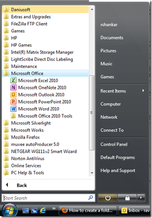

A **Windows desktop shortcut** for **Word 2010** can be created by following steps. Click Start button and navigate to All Programs

From the list of All Programs men, click the Microsoft Office folder. This would display the list of installed Microsoft Application including Microsoft Word 2010.

Right click on Microsoft Word 2010 and navigate to Send To menu and then click the Desktop (create shortcut). This would **create a desktop shortcut** for **Word 2010**.

