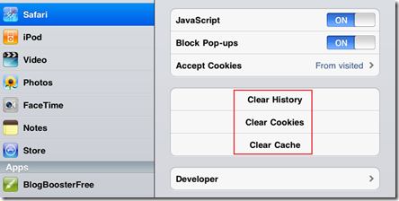
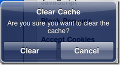

iPad 2 provides a good browsing experience to the user through the pre-installed Safari browser. It also allows users to clear the browsing history, cache and cookies. This can be done using the Safari settings option in the iPad.

To clear the browsing history in iPad

- Tap settings icon on your iPad home screen.
- In the settings screen, navigate to General settings and then to Tao Safari menu option.

- In the Safari settings, navigate down to see the list of menu options available for clearing the browsing history, cookies and cache.

**Read: [How to enable iPad to speak selected text](http://blogmines.com/blog/2013/08/22/how-to-enable-ipad-to-speak-selected-text/ "How to enable iPad to speak selected text")**

When you tap the clear history or any of these menu options you will be prompted with the following message depending upon the selected option.

Tap the Clear button to continue with the operation.
