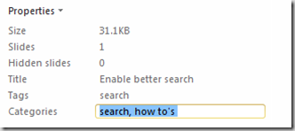

This tutorial explains how to add title, tag and category information to a PowerPoint Presentation file. Adding Title, Tag and Category information will keep you more organized and also help us during searches in a shared environment. To add these information to your PowerPoint Presentation file, click the File menu then Info menu option.

In the Info screen navigate to the section on the right hand side.

You can start providing the required details for your presentation file by editing the field adjacent to Title, Tags and Categories respectively. Also using the Related People section you can addition authors information as shown below. You can add the people from either your contacts or using the your address book.

After adding the required information, click the File –> Save options to save the entered details.
