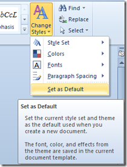
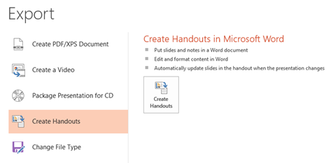
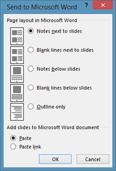

****

**Google Docs** has a feature that can **automatically** **detect** any links and apply the style accordingly. For example if you have type a text as http://digianswers.com in a Google Docs **document** then it would consider this as a hyperlink

But if you do not want the **hyperlink** then highlight the link and click on the **remove** link.

And if you want to permanently **turn off** the **auto detection** of links then click on the Tools menu and select **Preferences** from the list of available menus.

 

In the Preferences window, un mark the check box with label as **Automatically detect links** and click on the Ok button available at the bottom of the preferences window.

del.icio.us Tags: [Google Docs](http://del.icio.us/popular/Google+Docs),[Turn Off](http://del.icio.us/popular/Turn+Off),[Automatic](http://del.icio.us/popular/Automatic),[Detection](http://del.icio.us/popular/Detection),[Link](http://del.icio.us/popular/Link),[hyperlinks](http://del.icio.us/popular/hyperlinks),[remove](http://del.icio.us/popular/remove)
