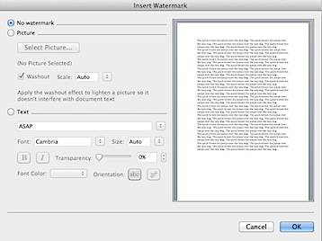
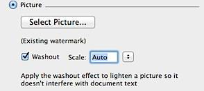

It is always recommended to [insert watermark](http://blogmines.com/blog/2010/08/09/how-to-insert-watermark-in-word-2010-document/) in your confidential document and this article explains how to **add watermark** in **Word 2011 for Mac**.

Click the Layout menu and navigate to Page Background section.

Click the Watermark option to launch the Insert Watermark window.

If you want to add your company logo as Watermark then select Picture radio option then browse and select the the logo using the Select Picture button. Picture Watermark also provides Washout and Scale option.

If you want to add text as a Watermark for the document then select Text radio option and enter the watermark text. Text Watermark provides user with different options such as Font Style, Transparency and Orientation.

