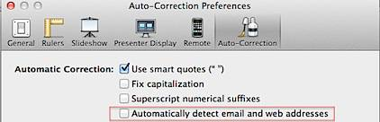

This tutorial provides the steps to **turn off** the **hyperlink** feature in **Keynote** on **Mac OS X Lion**. Click the Keynote menu and select Preferences from the menu list.

In the Preferences window, click the Auto-Correction tab and un mark the check box with label as Automatically detect email and web addresses.

Now if you type in any email or web addresses, keynote will not display the hyperlink.
