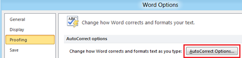
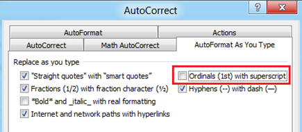

**Microsoft Word 2010** has a feature that **automatically replaces ordinals with superscript**. But if you do not want this feature then you can **turn off** using the option provided as part of AutoCorrect settings.

**Example of ordinals with superscript**

1st displayed 1st

2nd displayed as 2nd

**Disable ordinals with superscript**

Click the File menu then options link. In the Word Options window, navigate to **Proofing** section and click the AutoCorrect Options button.

Click the **AutoFormat As You Type** tab in AutoCorrect window and navigate to **Replace as you type** section. Now to **disable ordinals with superscript** feature, un mark the check box with label as Ordinals (1st) with superscript and then click Ok button to confirm and save the changes.

del.icio.us Tags: [turn off](http://del.icio.us/popular/turn+off),[ordinals](http://del.icio.us/popular/ordinals),[superscript](http://del.icio.us/popular/superscript),[word 2010](http://del.icio.us/popular/word+2010),[disable](http://del.icio.us/popular/disable),[AutoCorrect](http://del.icio.us/popular/AutoCorrect),[proofing](http://del.icio.us/popular/proofing)
