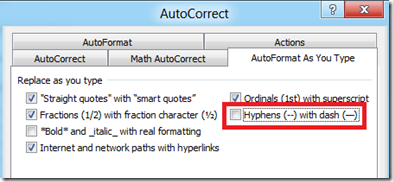

**AutoCorrect** in **Word 2010** has a feature which automatically converts two consecutive hyphens in em dash (\_\_). For example when you have words connected with hyphens like **June—December** (with two hyphens) will be changed to **June—December** (with em dashes). This feature is by default enabled on Microsoft Word 2010.

**Turn off hyphens with dash feature**

Users can turn off the auto replacement of hyphens with dashes using the option available as part of AutoCorrect settings. Click the File menu –> Options link and navigate to Proofing Option screen then click the AutoCorrect Options button in the Proofing screen.

In the AutoCorrect window, click the AuoFormat As You Type tab and navigate to Replace as you type section.

Now unmark the check box with label as **Hyphens (--) with dash (—)** and click OK button to confirm and save the changes.

del.icio.us Tags: [Word 2010](http://del.icio.us/popular/Word+2010),[auto](http://del.icio.us/popular/auto),[replace](http://del.icio.us/popular/replace),[hyphens](http://del.icio.us/popular/hyphens),[dashes](http://del.icio.us/popular/dashes),[turn off](http://del.icio.us/popular/turn+off),[autocorrect](http://del.icio.us/popular/autocorrect)
