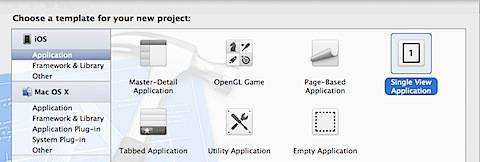
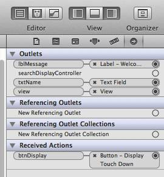
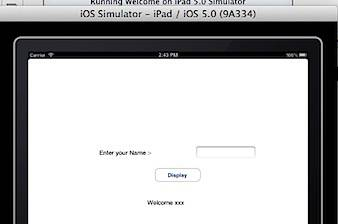

Here is an example of writing an iPad app that prints a Welcome message.

Launch Xcode, click File -> New -> New Project.

Now select the template for the project as Single View Application.

Provide the details for your project, like Product Name, Company Name then choose the device for which you are writing the App. Also mark the check box with label as Use Automatic Reference Counting and click the Next button.

And finally click the Create button to complete the project creation. Now Open the ViewController.xib file and using the Interface Builder designed add two label controls , TextField and Button as shown below.

Label 1 is used for displaying the caption "Enter your Name", TextField is used for accepting user input, Display button is used for printing the Welcome message in the second label.

Now edit ViewController.h file and add two IBOutlet elements for UITextField and UILabel and IBAction element for button as shown below.

#import <UIKit/UIKit.h>

@interface ViewController : UIViewController

{

IBOutlet UITextField \*txtName;

IBOutlet UILabel \*lblMessage;

}

\-(IBAction) btnDisplay;

@end

Then edit ViewController.m file and implement the IBAction function as shown below

\- (IBAction)btnDisplay {

lblMessage.text \= \[@"Welcome " stringByAppendingString: \[txtName text\]\];

}

This function creates local string by adding "Welcome " and suffixing it with the name entered in the Textfield. After completing the coding part, it is time to connect the UI Interface elements with the Object References in code. Select ViewController.xib in the Project Navigator section then click the File's Owner under Place Holder section. Drag and drop the respective object references to the UI element and connect map the btnDisplay with the Button Touch Down event. The completing mapping of UI Interface elements with Object References is shown below. 

Now the Run the App in iPad simulator by clicking the Run option on the menu bar or by pressing Control + R on the Keyboard.  Now entering the name and clicking the Display button will print the Welcome message as shown below. 
