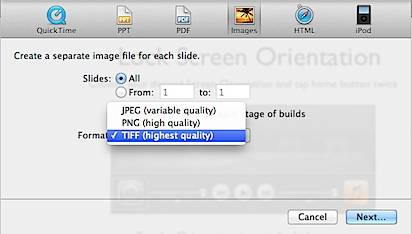

This article is about the feature that allows **Apple Keynote** users to **convert** the **slides** in to .PNG, .JPEG and .TIFF image files.

**Step 1**: Launch the Keynote App and open the Keynote presentation

**Step 2**: Click File menu and select **Export** from the menu list.

**Step 3**: Navigate to Images section and select the **Slides** that needs to be exported to images.

You have the option to specify all slides or range of slides. Similarly you are allowed to select the image format (JPEG, PNG, TIFF) from the drop down. After specifying the required details, click the Next button.

**Step 4**: Then click the Export button after providing a name and location for the images.

