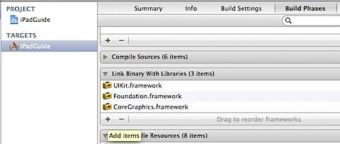
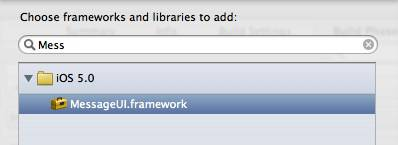
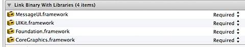

Xcode displays the **Apple Mach-O undefined symbols for architecture error** when the library referred in the code is not included as part of Build Phases. For example, I was instantiating MFMailComposeViewController in one of my project

  MFMailComposeViewController \*mc = \[\[MFMailComposeViewController alloc\] init\];

  

And while trying to compile the code, the build failed and displayed the following error.

Undefined symbols for architecture i386:   

"\_OBJC\_CLASS\_$\_MFMailComposeViewController", referenced from:

objc-class-ref in RootViewController.o

ld: symbol(s) not found for architecture i386

clang: error: linker command failed with exit code 1 (use -v to see invocation)

I was able to fix this issue by including the MessgeUI.framework library as part of the Build Phases.

In Xcode, navigate to Project Summary screen then to the Build Phases tab

Click the Add Items (+ sign) under **Link Binary With Libraries** section then select MessageUI.frameework from the list and click the Add button.

Similarly by including the relevant libraries you can resolve the obj-class-ref errors.
