Listed below are detail steps for provisioning iPhone 4S for deploying and testing Apps. The steps have been broadly classified in to the following topics.

- Requesting Development Certificate

- Submit Certificate in iOS Provisioning Portal  
    

- Installing Certificate  
    

- Registering Device to Provisioning Portal  
    

**Requesting Development Certificate**  

Requesting development certificate requires you to generate a Certificate Signing Request (CSR). The CSR can be generated using the KeyChain app available as part of the Mac OS. You can quickly launch keychain using spotlight search. Apart from generating the CSR, the Keychain app also generates the public and private key.

Select Keychain Access preferences from the menu list and navigate to Certificates tab.

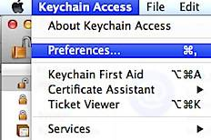

**Turn off the Online Certificate Status Protocol** (OCSP).

Now to request Certificate, click the **Keychain Access** menu, select Request a certificate from a Certificate Authority under the Certificate Assistant.

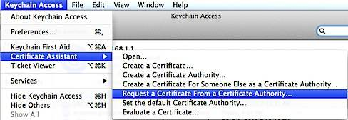

In the Certificate Assistant window, enter your email address, name and mark the radio option with caption as Saved to disk also the check box with label as Let me specify key pair information.

  
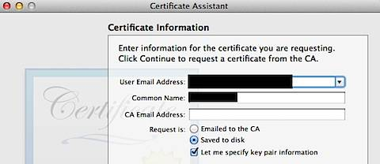

Save the generated certificate to your desktop.

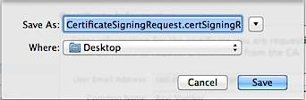

Then for the Key Pair information, select Key Size as **2048** bits and Algorithm as **RSA**.

On clicking the continue button will display the following confirmation message.

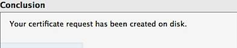

The login section under Keychain Access would display the generated Public key and Private key.

**Submitting Request in Provisioning Portal**

Login to the members account with your Apple user id and password. Click the **iOS Provisioning Portal** link available under Developer Program Resources section.

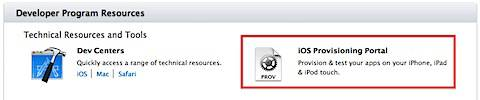

In the Provisioning Portal, navigate to Certificates section and click the Request Certificate button under Development.

This would display a screen with option to submit the CSR.

  

Choose the required CSR and click the Submit button. After submitting the status would initially be displayed as **Pending issuance** and later a download link would appear.

  

Now install the WWDR certificate and iOS developer Certificate on your Mac system

  
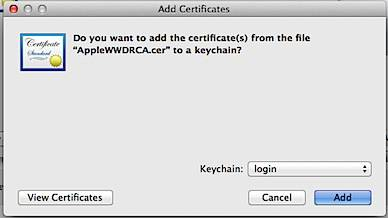

  

You can verify the installation of certificates by navigating to My Certificates in Keychain Access App.

  
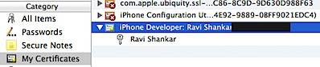

**Registering Device to Provisioning Portal**

You can use Xcode for registering the Device ID and this process also create the App ID. Launch Xcode, click the Window menu option and select Organizer from the menu list.

This would display the list of available Devices that have been connected to the Mac system,

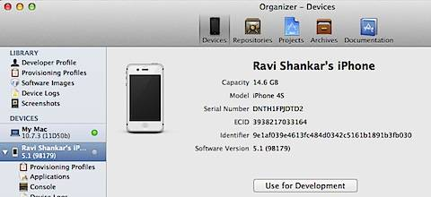

When the device is connected, a green status light will be displayed. Now select iPhone 4S and click the Use for Development button. If your Device and Mac system are out of sync with the iOS SDK then you will get the message to keep both of them in sync.

  
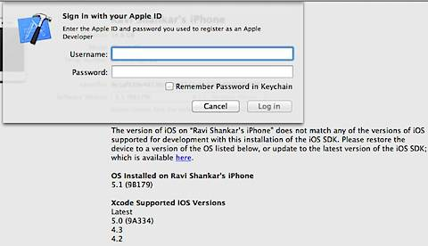

Once the device and Mac system are in sync, you can add the device to Provisioning Portal by right clicking on the device and selecting **Add Device to Provisioning Portal**.

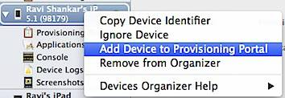

Xcode will request permission for accessing your Keychain, click Always Allow button and sign-in with your Apple Developer Account credentials. Also allow code sign to sign using your key in keychain.

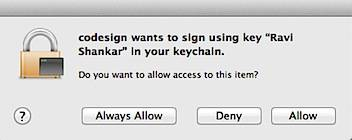

Now you can test your app on iPhone 4S by selecting the device from Active Scheme list.

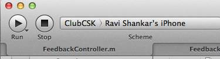
