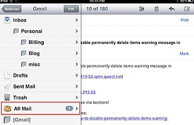

This answers the query posted by a reader regarding "How to retrieve the [archive messages in iPad](http://blogmines.com/blog/2011/07/06/how-to-archive-email-messages-in-ipad-2/) ". The below mentioned steps can be used for seeing the archived messages of GMail account on iPad as well as iPhone.

**Step 1**: Tap the mail icon on iPad or iPhone.

**Step 2**: In the Mail App, navigate to Accounts section and tap your Gmail account.

**Step 3:** The GMail account Mailbox will display a folder named All Mail.

The All Mail folder would contain all the archived message of GMail account on your iPad on iPhone.  

**Read: [How to block contact in IOS 7 for iPhone](http://blogmines.com/blog/2013/09/25/how-to-block-contact-in-ios-7-for-iphone/ "How to block contact in IOS 7 for iPhone")**
