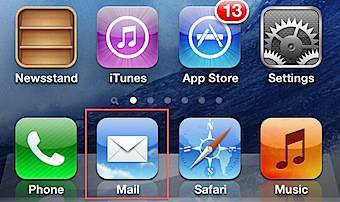
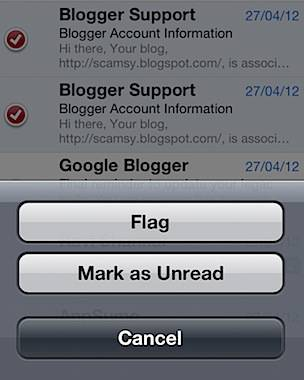

This tutorial provides the steps required for archiving multiple email messages on iPhone or iPad. You can use the same procedures for deleting or moving more than one messages.

**Step 1**: Tap the Mail app on iPhone or iPad.

**Step 2**: Select the mailbox for archiving email messages then tap the Edit button.

**Step 3**: You can use the check box for selecting the email messages.

**Step 4**: Then tap the button available at the bottom of the screen to **archive** the **message**.

Step 5: You can also move the selected messages to a different fodder using the **Move** button or **Flag** the messages using the Mark option.

**Screenshot of delete option available for mail account configured on iPad**

