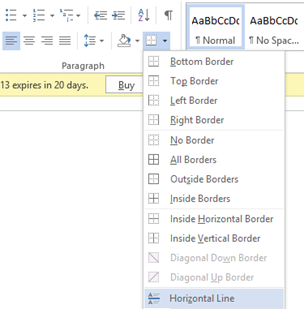

Listed below are the steps required for **inserting horizontal line in Word 2013**.

**Step 1**: Open the document where you want to **add horizontal line** in Word 2013.

**Step 2**: Position mouse cursor at the point of insertion.

**Step 3**: Navigate to the Paragraph section in the Home menu.

**Step 4**: Click the Border menu option and select Horizontal line from drop down menu list.

This should **insert a horizontal line** at the current cursor position as shown below.

<iframe width="420" height="315" src="//www.youtube.com/embed/-DeDzE-JXRk" frameborder="0" allowfullscreen></iframe>
