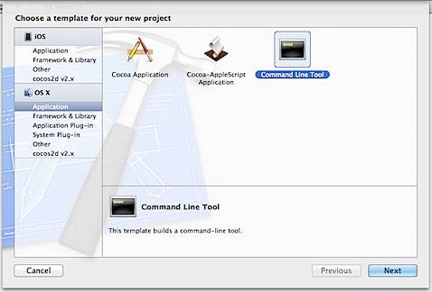
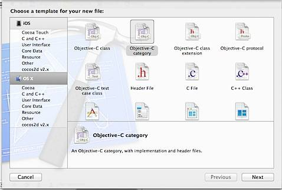
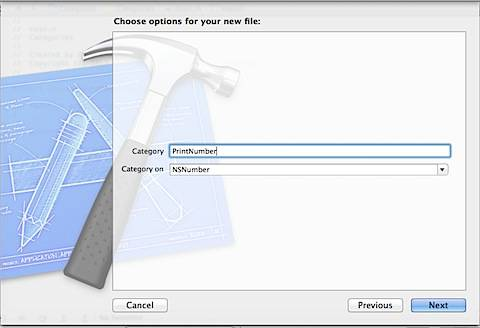

**Categories** in **Objective-C** are used for adding **extra functionality** to a class without accessing the source code of the class and without subclassing it. Let us see this with an example by adding an additional method to NSNumber that just writes the value of the NSNumber argument to NSLog.

**Create Project**

Create a new **Command Line Tool** project for the example by providing the required details and selecting Type as Foundation.

**Add Objective-C Category**

Right click on the project, select New File then choose template for your new file as **Objective-C category**.

  

Provide the name for your Category and select Category On as NSNumber (The class for which we are adding the additional method)

**Write Implementation**

Two new files NSNumber+PrintNumber.h and NSNumber+PrintNumber.m files will be added to your project. Define the new method for NSNumber in the header file as shown below.

@interface NSNumber (PrintNumber)

\-(void) printNumber: (NSNumber \*) num;

@end

where printNumber is the new method that takes num of type NSNumber as the argument.

In the implementation file (NSNumber+PrintNumber.m ), add the code that write the value number to NSLog.

\-(void) printNumber: (NSNumber \*) num

{

NSLog(@” The number value is %@”, num);

}

**Using Categories**

Now in main.m file make a call to the new method of NSNumber after importing the “NSNumber+PrintNumber.h” as shown below.

#import <Foundation/Foundation.h>

#import “NSNumber+PrintNumber.h”

  

int main(int argc, const char \* argv\[\])

{

  

@autoreleasepool {

// insert code here…

NSLog(@”Hello, World!”);

NSNumber \*num = \[\[NSNumber alloc \] initWithInt:25\];

\[num printNumber:num\];

}

return 0;

}

  

The call to \[num printNumber:num\] will write the value to the console.

\- Categories have access to instance variable of the original class but cannot have its own instance variable.

\- Categories on parent class will be available for all its subclass as well.

\- Using Categories you can override another method in the class.

\-
