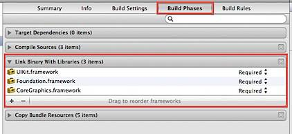
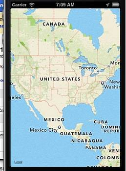

**Problem** :- Xcode project with MapView control displays the error "'NSInvalidUnarchiveOperationException', reason: 'Could not instantiate class named MKMapView'"

**Solution** :- The 'Could not instantiate class named MKMapView' error is displayed when the Xcode project with MapView control on xib does not include the MapKit library as part of the Link Libraries.

Select the Xcode project and navigate to Build Phases.

Click the + sign under Link Binary with Libraries and select MapKit,framework from framework and libraries to add selection window.

Now running the project should not display the NSInvalidUnarchiveOperationException.

