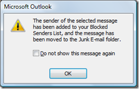
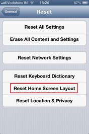
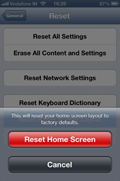

This is a short tip on the steps required to **auto arrange your apps on iPhone and iPad Home screen**. This is useful when you have removed lot of unwanted apps on your device’s home screen and manually re-arranging the icons will be nightmare.

**Step 1**: Access iPad or iPhone home screen and tap the Settings icon.

**Step 2**: In the Settings screen, navigate to General Options.

**Step 3**: Scroll down and tap the Reset option under General Settings.

**Step 4**: In the Reset screen. tap the Reset Home Screen Layout option. Then confirm your action by tapping the Reset Home Screen button. This should do the trick and will auto arrange all your apps on the Home screen.
