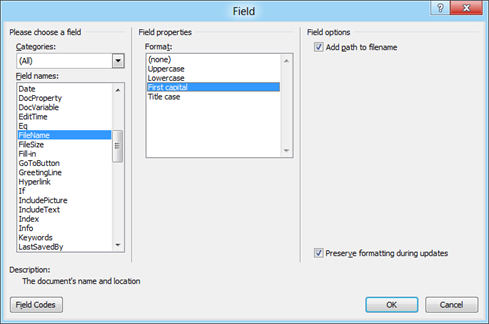

Microsoft Publisher automatically converts a word document in to Publisher File. Listed below are the steps for importing a word document using Publishing 2013.

**Step 1**: Launch Publisher 2013.

**Step 3**: Click File menu and select Open from the menu list.

**Step 3**: Now locate the word document that needs to imported in to Publisher using the **Open Publishing** window.

On clicking the Open button, Publisher will automatically convert the Word document in to a Publisher file with the following “Publisher is converting the file” message.

