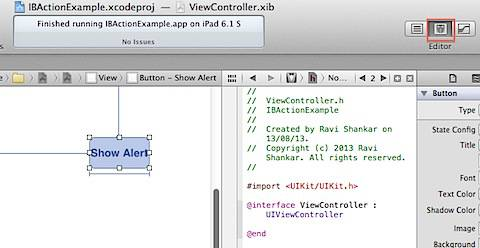
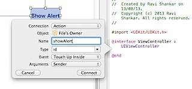
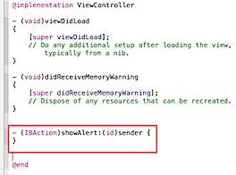
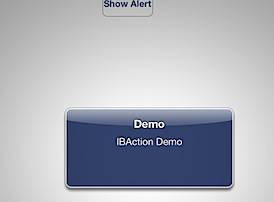
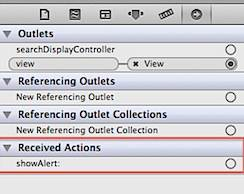
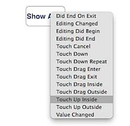

In this tutorial, we are going to see the different ways for **connecting IBAction to UIButton.** Let see this with an example that displays an alert message on the touch event of UiButton.

**Method 1 (Assistant Editor)**:  
**Step 1**: Drag and drop Round Rect Button from the Objects library on to Interface builder.  
**Step 2**: Now click the **Show Assistant Editor** option on Xcode toolbar. This should display the Interface builder and code editor adjacent to each other as shown below.  
  
**Step 3**: Select the button on Interface builder then hold control key on keyboard and drag the line to the editor window (.h file).  
  
  
You should notice **Insert Outlet, Action or Outlet Collection** entry as shown in the above screenshot. Selecting the option would display a window for defining the IBAction.  
**Step 4**: Select "Action" for Connection, provide a name (e.g.:- showAlert), Event as "Touch Up Inside" then click Connect. This should add a new IBAction entry in the header and implementation file.  
  
**Header file (.h)**  
  
**Implementation File (.m)**  
**Step 5** : Now add the following UIAlertView code inside the showAlert method in implementation file.  

  

  UIAlertView \*alertView = \[\[UIAlertView alloc\] initWithTitle:@"Demo" message:@"IBAction Demo" delegate:self cancelButtonTitle:nil otherButtonTitles:nil, nil\];

  \[alertView show\];

  

  

Executing the project in the simulator should display the following alert on tapping the Button.  

  

  

**Method 2 (Connections Inspector)** :

  

**Step 1**: Drag and drop a Round Rect Button on to the Interface builder.

  

**Step 2**: Navigate to implementation file and add the following IBAction code for displaying the Alert.

  

  

  

**Step 3**: Open nib file, navigate to **Show Connections Inspecto**r option available on the left hand side.

  

  

Selecting the File Owner's option should display the details in the Connections Inspector. This should display the IBAction method under the **Received Actions** section.

  

  

**Step 4**: select showAlert and drag it to the UIButton on the Interface builder.

  

Releasing the mouse click should display the following Events list. Select Touch Up Inside from the list.

  

Once connected, you should see the connection between the IBAction method and the control under Received Actions.

  

  

**Method 3 (Programmatically)**:

  

**Step 1**: Launch the implementation file for adding the Round Rect Button Programmatically.

  

**Step 2**: Add the IBAction showAlert method with the following alert message.

  

  UIAlertView \*alertView = \[\[UIAlertView alloc\] initWithTitle:@"Demo" message:@"IBAction Demo" delegate:self cancelButtonTitle:nil otherButtonTitles:nil, nil\];

  \[alertView show\];

  

  

  

**Step 3**: Navigate to ViewDidLoad Method and add the following code to instantiate UI button and connect button to **Touch Up Inside** event with showAlert method.

  

\- (void)viewDidLoad

{

\[super viewDidLoad\];

// Do any additional setup after loading the view, typically from a nib.

UIButton \*btnDemo = \[UIButton buttonWithType:UIButtonTypeRoundedRect\]; // Create Round Rect Type button.

btnDemo.frame \= CGRectMake(100, 100, 100, 100); // define position and width and height for the button.

\[btnDemo setTitle:@"Show Alert" forState:UIControlStateNormal\];

//connect the showAlert method with button target attribue. Also spectify when (event) you want to call

//this methid

\[btnDemo addTarget:self action:@selector(showAlert:) forControlEvents:UIControlEventTouchUpInside\];

\[self.view addSubview:btnDemo\];

}
