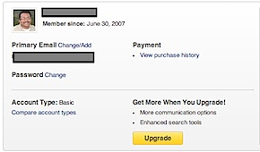
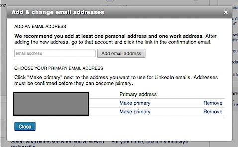

In this article we are going to see the steps required for changing the **primary email address** on **LinkedIn** account. If you have changed your job and want to **update the LinkedIn account with the new email address** then you can follow these simple steps.

**Step 1**: Login to your LinkedIn account.

**Step 2**: Navigate to top right corner and click **Account & Settings** option.

**Step 3**: In the Account & Settings drop down, select **Privacy & Settings** option.

**Step 4**: You will prompted to login with your LinkedIn credentials for authentication.

**Step 5**: Click **Change/Add** option available next to **Primary Email**.

**Step 6**: In the **Add & change email addresses** screen, enter the new email address and click Add email address button.

Then navigate to "**CHOOSE YOUR PRIMARY EMAIL ADDRESS**" section and click **Make primary** link to make the new email address as the primary email address for your LinkedIn account.

**You might also be interested in**:

- **[Turn off profile change notification on LinkedIn](http://blogmines.com/blog/2011/11/16/how-to-turn-off-profile-change-notification-on-linkedin/).**

- **[Disable display of viewers profile on LinkedIn page](http://blogmines.com/blog/2012/10/22/disable-the-display-of-viewers-of-this-profile-also-viewed-in-linkedin/).**
    

- **[Change email preferences in LinkedIn Account.](http://blogmines.com/blog/2011/12/08/how-to-change-the-email-preferences-in-linkedin/)**
