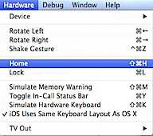

**Photos Album** in [iOS Simulator i](https://rshankar.com/xcodes-ios-simulator-for-iphone-and-ipad/)s generally empty and if you are writing apps using Photos functionality then you might need some photos in them. Listed below are the steps for **placing photos** under the Photos Album in Simulator.

**Step 1**: Access the Home screen on iOS simulator. (Hardware > Home)

If you tap Photos then you should see “**No Photos or Videos**” message.

**Step 2**: Now tap Safari icon on your Home screen.

**Step 3**: Open Finder window, locate the image that you want to copy then drag and drop the image on to Safari browser.

**Step 4**: Right click and hold for some time until you see the action sheet with an option to Save Image.

Navigate back to Home screen, tap the Photos option and this should show display the recently added Photo.

