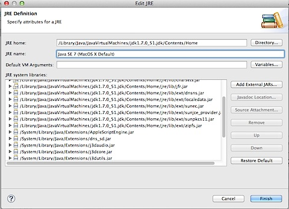

This is not related with iOS development but I have deployed the backend service for my iOS app on Google App Engine. This is about the steps for resolving the “JRE version is 1.6.0 1.7.0 or later is needed to run Google Plugin for Eclipse”.

  

1\. Download the latest JDK from oracle website - [http://www.oracle.com/technetwork/java/javase/downloads/jdk7-downloads-1880260.html](http://www.oracle.com/technetwork/java/javase/downloads/jdk7-downloads-1880260.html).  

2\. For some reason the JDK installation folder on Mac was still referring to Java 1.6 and had to install this fix to get 1.7 folder - [http://support.apple.com/kb/dl1572](http://support.apple.com/kb/dl1572)

3\. Then install the latest Google App Engine eclipse plugin using the **Check for Updates** on Eclipse.

4\. I am not 100% sure whether app engine SDK needs to be installed on Mac even after installing eclipse plugin but I went with this step. Download latest app engine SDK for mac [https://developers.google.com/appengine/downloads#Download\_the\_Google\_App\_Engine\_SDK](https://developers.google.com/appengine/downloads#Download_the_Google_App_Engine_SDK)

5\. The most important step of all is to edit eclipse.ini file and add -vm param with jdk 1.7 (marked in bold). Make sure this entry is the first vm entry in eclipse.ini file.

> \-startup
> 
> ../../../plugins/org.eclipse.equinox.launcher\_1.2.0.v20110502.jar
> 
> \--launcher.library
> 
> ../../../plugins/org.eclipse.equinox.launcher.cocoa.macosx.x86\_64\_1.1.101.v20120109-1504
> 
> \-product
> 
> org.eclipse.epp.package.jee.product
> 
> \--launcher.defaultAction
> 
> openFile
> 
> \-showsplash
> 
> org.eclipse.platform
> 
> \--launcher.XXMaxPermSize
> 
> 256m
> 
> \--launcher.defaultAction
> 
> openFile
> 
> **\-vm**
> 
> **/Library/Java/JavaVirtualMachines/jdk1.7.0\_51.jdk/Contents/Home/jre/lib/server/libjvm.dylib**
> 
> \-vmargs
> 
> \-Dosgi.requiredJavaVersion=1.5
> 
> \-XstartOnFirstThread
> 
> \-Dorg.eclipse.swt.internal.carbon.smallFonts
> 
> \-XX:MaxPermSize=256m
> 
> \-Xms40m
> 
> \-Xmx512m
> 
> \-Xdock:icon=../Resources/Eclipse.icns
> 
> \-XstartOnFirstThread
> 
> \-Dorg.eclipse.swt.internal.carbon.smallFonts
