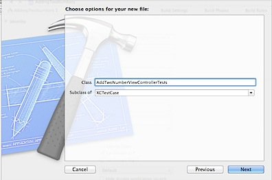
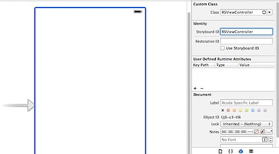
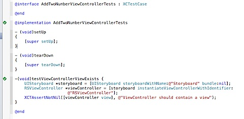
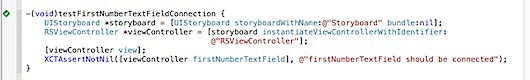
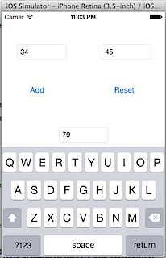

This is in continuation of the [Test Driven Development in iOS - Beginners tutorial](https://rshankar.com/test-driven-development-in-ios-beginners-tutorial-part-1/) and this covers writing XCTest user interfaces in iOS. AddingTwoNumbers app will have following controls

1\. Three textfields - For entering the numbers and displaying the result.

2\. Two buttons - Add button to perform addition and Reset button to clear all the textfields.

Let us create a new Test case class for testing the user interface, AddTwoNumberViewControllerTests.m

The first test written is for checking the App Delegate call, storyboard, view controller and view.

\-(void)testViewControllerViewExists {

UIStoryboard \*storyboard = \[UIStoryboard storyboardWithName:@"Storyboard" bundle:nil\];

RSViewController \*viewController = \[storyboard instantiateViewControllerWithIdentifier:

@"RSViewController"\];

XCTAssertNotNil(\[viewController view\], @"ViewController should contain a view");

}

  

The following needs to be done for passing this test.

  

1\. Add new Objective-C class, subclass of UIViewController (RSViewController).  

  

2\. Add a Storyboard file to your project which would contain the ViewController required for this app.

3\. Drag and drop, UIViewController on the storyboard and set the class name for the ViewController as RSViewController and StoryboardID as RSViewViewController.

4\. Now add the code required in App Delegate’s didFinishLaunchingWithOptions method. This should load the storyboard then instantiate the view controller and set it as RootViewController.

\- (BOOL)application:(UIApplication \*)application didFinishLaunchingWithOptions:(NSDictionary \*)launchOptions

{

UIStoryboard \*storyboard = \[UIStoryboard storyboardWithName:@"Storyboard" bundle:\[NSBundle mainBundle\]\];

UIViewController \*vc =\[storyboard instantiateInitialViewController\];

// Set root view controller and make windows visible

self.window \= \[\[UIWindow alloc\] initWithFrame:\[\[UIScreen mainScreen\] bounds\]\];

self.window.rootViewController \= vc;

\[self.window makeKeyAndVisible\];

return YES;

}

A lot has been added to just pass a single test case, probably this can be broken up by writing some more tests.  

  

Next add the test for checking the FirstNumber UITextField connection.

\-(void)testFirstNumberTextFieldConnection {

UIStoryboard \*storyboard = \[UIStoryboard storyboardWithName:@"Storyboard" bundle:nil\];

RSViewController \*viewController = \[storyboard instantiateViewControllerWithIdentifier:

@"RSViewController"\];

XCTAssertNotNil(\[viewController firstNumberTextField\], @"firstNumberTextField should be connected");

}

Next add the test for checking the FirstNumber UITextField connection.  

\-(void)testFirstNumberTextFieldConnection {

UIStoryboard \*storyboard = \[UIStoryboard storyboardWithName:@"Storyboard" bundle:nil\];

RSViewController \*viewController = \[storyboard instantiateViewControllerWithIdentifier:

@"RSViewController"\];

\[viewController view\];

XCTAssertNotNil(\[viewController firstNumberTextField\], @"firstNumberTextField should be connected");

}

  

This test would pass after adding the IBOutlet for UITextField in the interface file.

  

#import <UIKit/UIKit.h>

  

@interface RSViewController : UIViewController

  

@property (nonatomic,strong) IBOutlet UITextField \*firstNumberTextField;

  

@end

  

Then add UITextField to the ViewController and make the connection to UITextField with IBOutlet property.  

  

  

  

Then add similar test cases for secondNumber and result textfields. Also make corresponding changes to pass the test.  

  

\-(void)testSecondNumberTextFieldConnection {

UIStoryboard \*storyboard = \[UIStoryboard storyboardWithName:@"Storyboard" bundle:nil\];

RSViewController \*viewController = \[storyboard instantiateViewControllerWithIdentifier:

@"RSViewController"\];

\[viewController view\];

XCTAssertNotNil(\[viewController secondNumberTextField\], @"secondNumberTextField should be connected");

}

  

\-(void)testresultTextFieldConnection {

UIStoryboard \*storyboard = \[UIStoryboard storyboardWithName:@"Storyboard" bundle:nil\];

RSViewController \*viewController = \[storyboard instantiateViewControllerWithIdentifier:

@"RSViewController"\];

\[viewController view\];

XCTAssertNotNil(\[viewController resultTextField\], @"resultTextField should be connected");

}

  
  
  
Before we move on to the Button test cases, let us refactor the test cases code and remove the duplication of code. The common code has been moved to setup method and now the test cases should loo lot simpler.  

@implementation AddTwoNumberViewControllerTests

{

RSViewController \*viewController;

}

  

\- (void)setUp

{

\[super setUp\];

UIStoryboard \*storyboard = \[UIStoryboard storyboardWithName:@"Storyboard" bundle:nil\];

viewController \= \[storyboard instantiateViewControllerWithIdentifier:

@"RSViewController"\];

\[viewController view\];

}

  

\- (void)tearDown

{

\[super tearDown\];

}

  

\-(void)testViewControllerViewExists {

XCTAssertNotNil(\[viewController view\], @"ViewController should contain a view");

}

  

\-(void)testFirstNumberTextFieldConnection {

XCTAssertNotNil(\[viewController firstNumberTextField\], @"firstNumberTextField should be connected");

}

  

\-(void)testSecondNumberTextFieldConnection {

XCTAssertNotNil(\[viewController secondNumberTextField\], @"secondNumberTextField should be connected");

}

  

\-(void)testresultTextFieldConnection {

XCTAssertNotNil(\[viewController resultTextField\], @"resultTextField should be connected");

}

  
Now add the failing test case for Add button and see if the button exists.  

\-(void)testAddButtonConnection {

XCTAssertNotNil(\[viewController addButton\], @"add button should be connected");

}

  

And to pass the above test, add button to ViewController, create a addButton IBOutlet property of type UIButton and make connection to IBOutlet and button field.  

  

@property (nonatomic,strong) IBOutlet UIButton \*addButton;

  

  

  

  
Now add the next test case for checking IBAction method. The below method checks whether addButton call selector method addNumbers on UIControlEventTouchUpInside.  

\-(void)testAddButtonCheckIBAction {

NSArray \*actions = \[viewController.addButton actionsForTarget:viewController

forControlEvent:UIControlEventTouchUpInside\];

XCTAssertTrue(\[actions containsObject:@"addNumbers:"\], @"");

}

  
Add this method to RSViewController.m and link this to touchUpInside event of addButton.  

\-(IBAction)addNumbers:(id)sender {

}

  
Then add the below test cases for checking the addition of two numbers.  

\-(void)testAddingTenPlusTwentyShouldBeThirty {

viewController.firstNumberTextField.text \= @"10";

viewController.secondNumberTextField.text \= @"20";

\[viewController.addButton sendActionsForControlEvents: UIControlEventTouchUpInside\];

XCTAssertEqualObjects(viewController.resultTextField.text,@"30","Result of the textfield should be 30");

}

  
Make changes to the addNumbers method in RSViewController.m by calling application logic method in Addition.m  

\-(IBAction)addNumbers:(id)sender {

RSAddition \*addition = \[\[RSAddition alloc\] init\];

NSInteger result = \[addition addNumberOne:\[self.firstNumberTextField.text integerValue\] withNumberTwo:\[self.secondNumberTextField.text integerValue\]\];

self.resultTextField.text \= \[NSString stringWithFormat:@"%d",result\];

}  
Now repeat the test cases for reset button which clears all the textfields.  

\-(void)testResetButtonConnection {

XCTAssertNotNil(\[viewController resetButton\], @"reset button should be connected");

}

  

\-(void)testResetButtonCheckIBAction {

NSArray \*actions = \[viewController.resetButton actionsForTarget:viewController

forControlEvent:UIControlEventTouchUpInside\];

XCTAssertTrue(\[actions containsObject:@"resetFields:"\], @"");

}

  

\-(void)testResetButtonShouldClearFields {

viewController.firstNumberTextField.text \= @"10";

viewController.secondNumberTextField.text \= @"20";

viewController.resultTextField.text \= @"30";

\[viewController.resetButton sendActionsForControlEvents: UIControlEventTouchUpInside\];

XCTAssertEqualObjects(viewController.firstNumberTextField.text, @"", @"FirstNumber textfield should be empty");

XCTAssertEqualObjects(viewController.secondNumberTextField.text, @"", @"SecondNumber textfield should be empty");

XCTAssertEqualObjects(viewController.resultTextField.text, @"", @"Result textfield should be empty");

}

  
And the corresponding changes to the user interface and RSViewController.m file  

\-(IBAction)resetFields:(id)sender {

self.firstNumberTextField.text \= @"";

self.secondNumberTextField.text \= @"";

self.resultTextField.text \= @"";

}

  
Though lot more test cases can be added, I believe this is a decent starter project for learning TDD in iOS. And it is always nice to see the green mark in test navigator.  
  
Now you should be able to run your app and test the functionality.  
  
  
Source code can be downloaded from [here](https://github.com/rshankras/AddingTwoNumbers-Part1)
