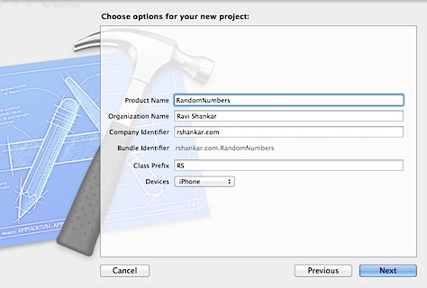

Let us see how to use motion and touch event in iOS by looking through a simple project that displays random number. This project displays random number on a label for a touch and motion event. Check out [this](https://developer.apple.com/library/ios/documentation/EventHandling/Conceptual/EventHandlingiPhoneOS/Introduction/Introduction.html#//apple_ref/doc/uid/TP40009541-CH1-SW1) link for more about events in iOS

After creating a single view application, add a new class that contains the method for generating random. If you do not want to add new class just for a single method then you can add the method as part of your ViewController class itself. arc4random\_uniform accepts a seed value (90) and generated number will be below this seed value.

\-(NSInteger)generateNumber {

   return arc4random\_uniform(90);

}

  

Now add a UILabel for displaying the generated random numbers. This includes both adding IBOutlet property and connecting it with UILabel on Interface Builder.  

**Motion Event**

  

The are three motion-handling methods \-(void)motionEnded:(UIEventSubtype)motion withEvent:(UIEvent \*)event, \-(void)motionBegan:(UIEventSubtype)motion withEvent:(UIEvent \*)event and \-(void)motionCancelled:(UIEventSubtype)motion withEvent:(UIEvent \*)event

In this example, we can use the **motionEnded** method to call the displayNumber method

\-(void)motionEnded:(UIEventSubtype)motion withEvent:(UIEvent \*)event {

if (UIEventSubtypeMotionShake) {

\[self displayNumber\];

}

}

  

\-(void)displayNumber {

RandomNumber \*randomNumber = \[\[RandomNumber alloc\] init\];

self.displayRandomNumber.text \= \[NSString stringWithFormat:@"%d",\[randomNumber generateNumber\]\];

}

And to test this on Simulator, use the Shake Gesture menu under Hardware to simulate motion event.

**Touch Event**

There are four touch events corresponding to each touch phase.

\-(void)touchesBegan:(NSSet \*)touches withEvent:(UIEvent \*)event

\-(void)touchesMoved:(NSSet \*)touches withEvent:(UIEvent \*)event

\-(void)touchesCancelled:(NSSet \*)touches withEvent:(UIEvent \*)event

\-(void)touchesEnded:(NSSet \*)touches withEvent:(UIEvent \*)event

  
In this example, we will use the **touchesEnded** method for displaying the random numbers.  

\-(void) touchesEnded:(NSSet \*)touches withEvent:(UIEvent \*)event {

\[self displayNumber\];

}

  
You can download the source code along with TDD classes for this beginner tutorial on touch and motion event from [here](https://github.com/rshankras/RandomNumbers.git).
