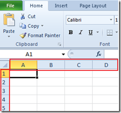
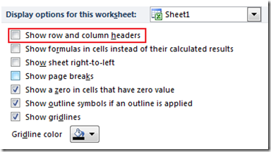
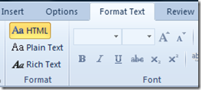

Windows 8.1 users can make Internet Explorer as the default browsers using Internet Options. Windows 8.1 comes with IE 11 as the default browser but if you have changed this setting then you can follow the below mentioned steps to revert the changes.

### How to set Internet Explorer 11 as default browser

**Step 1**: Launch Internet Explorer and click the Settings icon available on the Top right hand side.

**Step 2**: Navigate to Programs tab in Internet Options window.

**Step 3**: Click “**Make Internet Explorer the default browser**” link under Opening Internet Explorer section. This should launch the Default Programs window as shown below.

**Step 4**: Select Internet Explorer under Programs section then choose “**Set this program as default**” option.

If you want to make Internet Explorer as default programs for only selected file types then click **Choose defaults for this program** option. Now select the extensions for which you want to have Internet Explorer as the default program.

**Also See**: [How to disable the default browser check for Internet Explorer](http://blogmines.com/blog/2010/09/14/how-to-disable-the-default-browser-check-for-internet-explorer/)
