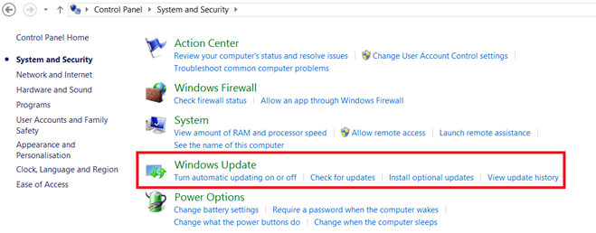
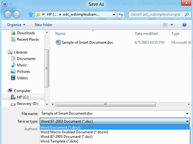
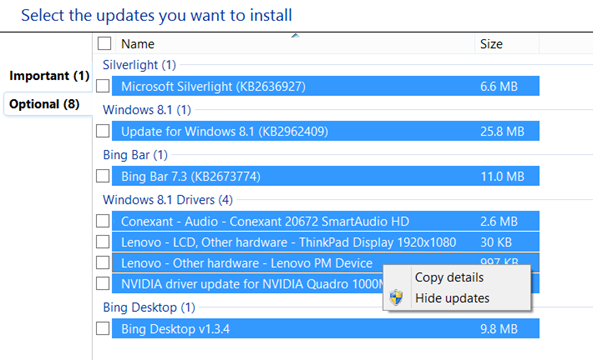

In this short tutorial, we are going cover the steps required to **hide and restore windows updates** on Windows 8.1.

**Why do you want to hide windows updates?**

It is recommended to install all the major updates or patches released for Operating Systems. But if there are any Important or Optional updates for some built-in application which your are using then you hide those updates. For example, you are using Google Chrome instead of Internet Explorer then you can skip all the updates delivered for Internet Explorer. When you hide those updates, Windows will keep you prompting about the available updates.

**Listed below are the steps to hide Windows Updates on Windows 8.1**

**Step 1**: Right click on Windows icon and select Control Panel from the list.

**Step 2**: In the Control Panel window, select **System and Security** option.

**Step 3**: In the System and Security window, click Windows Update link

  
**Step 4**: Select the updates listed under Windows Update screen.

Let us say you want to hide all the optional updates, Click Optional updates under the listed updates.

**Step 5**: In the “**Select the updates you want to install**” screen, select the updates that you want hide (not the check box selection) then right click and choose **Hide updates**.

This should disable all the checkboxes and prevent users from selecting those updates.

**How to unhide or restore hidden updates on Windows 8.1**

If you later decide to change your mind and want to install the hidden updates then you can restore using the “**Restore hidden updates**” option under Windows Update screen.  

In the Restore Updates screen, select the updates and click the Restore button available at the bottom of the screen. This should make the updates available for installing on your Windows 8.1.

Also See: [Checking whether your Windows 8 PC is up to date?](http://blogmines.com/blog/checking-whether-your-windows-8-pc-is-up-to-date/)
