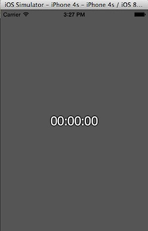

In this short tutorial, we will see the steps required for implementing UIGestureRecognizer in Swift programming language. Let us take the previous Stop Watch demo code and **implement tap, double tap and swipe gestures**. You can download source code for Stop Watch from [here](https://github.com/rshankras/SimpleStopDemo.git).

The following features will be implemented using the UIGestureRecognizer.

- Tap - Starts the timer.

- Double Tap - Stops the timer

- Swipe (from left to right) - Resets the timer.

**Remove the buttons**

Since we are replacing the buttons with gestures, these buttons can be removed from the View Controller. Navigate to Main.storyboard and select the Start and Stop buttons and delete them. Make sure the timer label is centre aligned both vertically and horizontally. Then click Reset to Suggested Constraints under Resolve Auto Layout Issues option.

**Write Gestures code**

Click SWViewController.swift file in the Project navigator and navigate to viewDidLoad function. Then add the following code to viewDidLoad method

  override func viewDidLoad() {

super.viewDidLoad()

let aSelector : Selector = "start:"

let tapGesture = UITapGestureRecognizer(target: self, action: aSelector)

tapGesture.numberOfTapsRequired = 1

view.addGestureRecognizer(tapGesture)

}

First this creates a constant to hold the selector argument which will be used when creating UITapGestureRecognizer. We are reusing the function that was used for the Start button.

Then we specify the numberOfTapsRequried and add the gesture as part of the view. Now repeat this for the stop button as well but for double tap.

  

  let bSelector : Selector = "stop:"

let doubleTapGesture = UITapGestureRecognizer(target: self, action: bSelector)

doubleTapGesture.numberOfTapsRequired = 2

view.addGestureRecognizer(doubleTapGesture)

tapGesture.requireGestureRecognizerToFail(doubleTapGesture)

  

The only difference is the number of taps required is specified as 2 and we are specifying that the single tap function will be called only when gesture is not double tap. Now if you try to run this project in the simulator, you should be able start and stop the timer using tap and double tap gestures.  

  

**Adding Swipe Gesture**

  

When the user does a swipe from left to right, the values in the timer label must be set to 00:00:00. We can do this by using the **UISwipeGestureRecognizer**. Let us first the add function that resets the timer label.

  

  @IBAction func reset(sender: AnyObject) {

displayTimeLabel.text \= "00:00:00"

}

  

Then add the following code to viewDidLoad method  

  

  let cSelector : Selector = "reset:"

let rightSwipe = UISwipeGestureRecognizer(target: self, action: cSelector)

rightSwipe.direction \= UISwipeGestureRecognizerDirection.Right

view.addGestureRecognizer(rightSwipe)

  

When a swipe from left to right is done the reset function is called. The viewDidLoad function with all the Gesture Recognizer should look as shown below.  

  

  override func viewDidLoad() {

super.viewDidLoad()

let aSelector : Selector = "start:"

let tapGesture = UITapGestureRecognizer(target: self, action: aSelector)

tapGesture.numberOfTapsRequired = 1

view.addGestureRecognizer(tapGesture)

let bSelector : Selector = "stop:"

let doubleTapGesture = UITapGestureRecognizer(target: self, action: bSelector)

doubleTapGesture.numberOfTapsRequired = 2

view.addGestureRecognizer(doubleTapGesture)

tapGesture.requireGestureRecognizerToFail(doubleTapGesture)

let cSelector : Selector = "reset:"

let rightSwipe = UISwipeGestureRecognizer(target: self, action: cSelector)

rightSwipe.direction \= UISwipeGestureRecognizerDirection.Right

view.addGestureRecognizer(rightSwipe)

  

}

  

Try running the project in simulator and check out tap, double tap and swipe gestures.  

  

  

[Source code](https://github.com/rshankras/StopWatchGesturesDemo.git)
