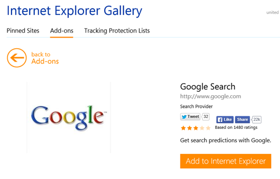
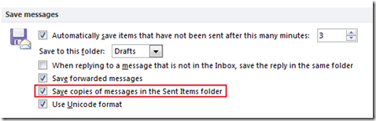
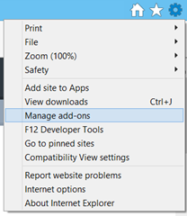
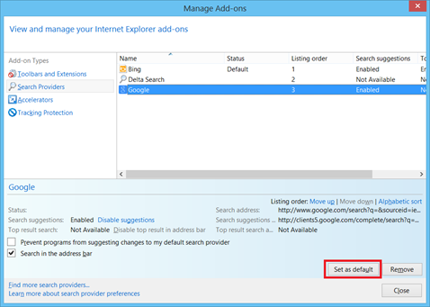

**Internet Explorer** is in-built with **Bing** as the **default search engine**. But it also provides users with the option to **change the default search provider**. Listed below are the steps for changing the default search engine in Internet Explorer 11 and 8

**Make Google as default search engine in Internet Explorer 11**

Launch Internet Explorer 11, navigate to address bar and click Search icon.

Then click the Add Search Provider option in Search bar.

Then select Google Search under Add-ons section

In the Internet Explorer Gallery screen, click Add to Internet Explorer button.

This should display the following Add Search Provider screen. Now mark the checkbox with caption as Make this my default search provider option. Then click Add button to confirm and save the changes.

**Modifying default search provider using Manage add-ons option**

If you had already added the search provider then you can follow the below mentioned steps to make it default.

Click the Tools menu and select Manage add-ons from the dropdown menu.

In the Manage Add-ons screen, navigate to Search Providers under Add-on-Types. Then select Google and click **Set as default** button.

**Set Google as default service provider in Internet Explorer 8**

To add **Google** as a default search provider then it involves the following two steps

- Adding Google **Search Providers** as **Add-ons** to Internet Explorer 8 (if not already added)
- Changing the Google as the default search provider

You can use the **Find More** **Search Providers** and add Google to the Internet Explorer 8. Find More Search Providers can be accessed through Menu option available on clicking the Search text box drop down.

Clicking on Find More Providers will display the Add-ons Gallery: Search Providers webpage and from this you can select Google and click on **Add to Internet Explorer button**. This would display Add Search Provider dialog box and to make Google as default search tick the check box **Make this my default search provider** and click on the Add button.

