[Internationalisation and Localization](http://stackoverflow.com/questions/506743/localization-and-internationalization-whats-the-difference) of apps is essential when you want the apps to seamlessly support different languages and region. Internationalization refers to process of providing a framework to the app for supporting multiple languages. And Localization refers to the process of making your app to support a particular locale such as German

In this tutorial, we are going to see an example app that supports text, number, date, currency and image localisation for English and German languages. This is done by following the below mentioned steps

- Use NSNumberFormatter, NSDateFormatter for Number, Currency and Date values.

- Internationalization of Storyboard.

- Internationalization of text.

- Internationalization of images.

**English**


**German**

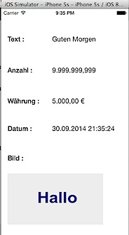

**Download source code from [GitHub](https://github.com/rshankras/Localisation-Demo.git)**

Create a new project by clicking File menu -> New -> Project


Select the template for the Project as Single View Application.

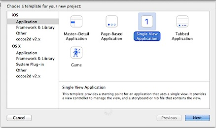

‘

In the next screen, provide a name for the project as “Localisation Demo” and select the Language as “Swift” then specify a location and save the project.

### User Interface changes - UILabels and UIImageView on ViewController

Navigate to Main.storyboard, click default View Controller. Drag and drop 9 Labels and 1 ImageView from Object Library on to Storyboard. These labels are used for displaying the caption and values as shown in the below screenshot.


### Declaring IBOutlets for UIControls

Click ViewController.swift in project navigator and add the following IBOutlets after the class declaration.  

```swift
@IBOutlet var textLabel: UILabel!
@IBOutlet var numberLabel: UILabel!
@IBOutlet var currencyLabel: UILabel!
@IBOutlet var dateLabel: UILabel!
@IBOutlet var imageView: UIImageView!
```

Navigate back to Main.storyboard and connect labels and imageView to the respective outlets.

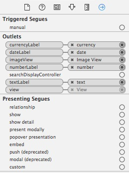

### Populate values for the controls.

Click ViewController.swift in Project Navigator and create a new function with name as populateValues  

```swift
func populateValues() {
    textLabel.text = “Good Morning”
    numberLabel.text = “9999999.999”
    currencyLabel.text = “50000”
    dateLabel.text = “07/08/2014”
    imageView.image = UIImage(named: “hello”)
}
```

The above function populates values for all the controls. The values which are assigned for the fields will be displayed in the screen without localization format. Then add this function as part of ViewDidLoad function.  

```swift
override func viewDidLoad() {
    super.viewDidLoad()
    populateValues()
}
```

Using Add Files to option, add the image [hello.png](https://github.com/rshankras/Localisation-Demo/blob/master/en.lproj/hello.png) to the Project folder.  

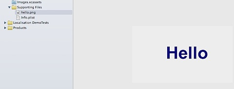

Now if you compile and run the project on iOS simulator, you should see the follow screen with values for the labels and image view.  


We do not see any formatting applied for Number, Date and Currency Values. Now let us see how to use NSNumberFormatter for formatting number and currency field and NSDateFormatter for formatting date field. Add the following properties after populateValues function in ViewController.swift file.  

```swift
var numberFormatter: NSNumberFormatter {
    let formatter = NSNumberFormatter()
    formatter.numberStyle = .DecimalStyle
    return formatter
}
```

```swift
var currencyFormatter: NSNumberFormatter {
    let formatter = NSNumberFormatter()
    formatter.numberStyle = .CurrencyStyle
    return formatter
}
```

```swift
var dateFormatter: NSDateFormatter {
    let formatter = NSDateFormatter()
    formatter.dateStyle = .MediumStyle
    formatter.timeStyle = .MediumStyle
    return formatter
}
```

In the above functions, we are creating respective formatter instances and setting the corresponding styles such DecimalStyle, CurrencyStyle then MediumStyle for date and time values. Now we need to update populateValues function to use these properties for displaying the values.  

```swift
func populateValues() {
    textLabel.text = “Good Morning”
    numberLabel.text = numberFormatter.stringFromNumber(9999999.999)
    currencyLabel.text = currencyFormatter.stringFromNumber(5000)
    dateLabel.text = dateFormatter.stringFromDate(NSDate())
    imageView.image = UIImage(named: “hello”)
}
```

Now after applying the correct format, iOS Simulator will use the default system region to display the values for number, currency and date fields  

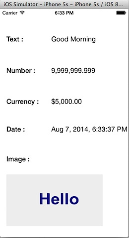

### Adding support for another language to your Xcode Project

In order to enable support for German language, first we need to add that language to the Project. This can be done by using the option available as part of Project target. Select the Project folder then the Project target.


Navigate to the Localization section and click the + sign then select German (de) from the list.

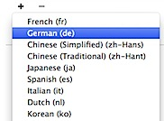

Choose the default files listed in the below screen and click Finish.

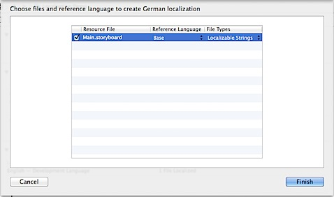

Now you should see support German language under Localizations section.


### Add Localization for controls in Storyboard

First let us see how to add support for another language for the Caption controls in Main.storyboard.


Expand Main.storyboard and click Main.strings (German) . Now enter the German equivalent for Date, Currency, Number and Image as Datum, Währung, Anzahl and Bild. And for rest of the controls, localization will be done in the code.

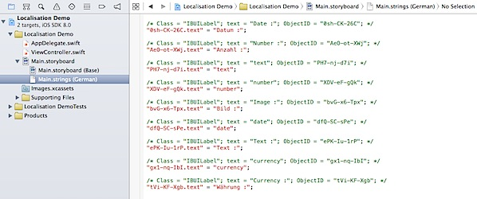
```plain
/* Class = “IBUILabel”; text = “Date :”; ObjectID = “0sh-CK-26C”; */ “0sh-CK-26C.text” = “Datum :”;

/* Class = “IBUILabel”; text = “Number :”; ObjectID = “AeO-ot-XWj”; */ “AeO-ot-XWj.text” = “Anzahl :”;

/* Class = “IBUILabel”; text = “number”; ObjectID = “XDV-eF-gQk”; */ “XDV-eF-gQk.text” = “number”;

/* Class = “IBUILabel”; text = “Image :”; ObjectID = “bvG-x6-Tpx”; */ “bvG-x6-Tpx.text” = “Bild :”;

/* Class = “IBUILabel”; text = “Currency :”; ObjectID = “tVi-KF-Xgb”; */ “tVi-KF-Xgb.text” = “Währung :”;
```

### Testing Localization changes in iOS Simulator

The changes to Main.storyboard (German) and NSNumberFormatter and NSDateFormatter will have no effect until we set the language and region to German in Xcode debug environment. Click **Set the active scheme** option and select Edit Scheme from the list.  

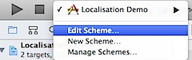

Navigate to Options under Debug Environment and select German and Germany for Application Language and Application Region.

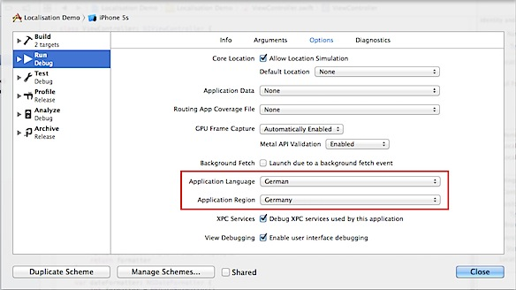

Now running the app on the iOS simulator should display the captions in german language and apply formats for number, date and currency fields based on German region.


### Internationalization of Text using NSLocalizedString

“Good Morning” has to be displayed in the corresponding German language i.e “Guten Morgen”. Add a new File to the project of type **Strings** and provide a name as **Localizable.strings**.

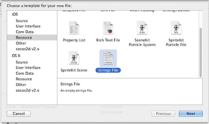

Select Localizable.Strings in Project Navigator and click Localize button available under File Inspector.


Then Select English in the Localize drop down and make sure to mark German in the Localization section under File Inspector.

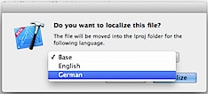

Now you should be able to expand Localizable.Strings under Project Navigator and see separate files for English and German.

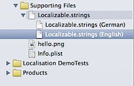

Add the following line in Localizable.Strings (English)

`GOOD_MORNING=“Good Morning”;`

Add the following line in Localizable.Strings (German)

`GOOD_MORNING=“Guten Morgen”;`

Now add the corresponding code to use the values from Localizable.Strings file. Click ViewController.swift and change

`textLabel.text = “Good Morning”`

to

`textLabel.text = NSLocalizedString(“GOOD_MORNING”,comment:“Good Morning”)`

NSLocalizedString will lookup for the corresponding entry in Localizable.Strings file for the supplied key. Running the app on iOS simulator should not display the German equivalent for “Good Morning”


### Internationalization of Images

In the above screenshot, you could see that text in the image is still in English. So we need to add the corresponding image that contains German text and make changes to pick up the entry based on the Application Language. After selecting hello.png in Project navigator, click Localize button under File Inspector. This should provide you with the option to Localize the file in English and German.


Make sure to tick both English and German under Localization section in File Inspector.

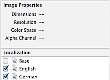

Open the Project folder in Finder tool and this should contain two folder for the languages de and en.


Now copy [hello.png](https://github.com/rshankras/Localisation-Demo/blob/master/de.lproj/hello.png) with german text to de.lproj folder. Do a clean build and run the app on iOS simulator with language and region set to German.  


**Download source code from [GitHub](https://github.com/rshankras/Localisation-Demo.git)**
