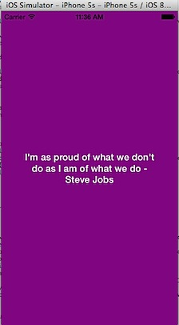
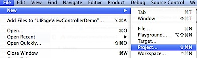
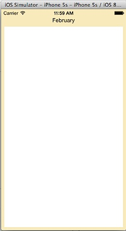

This is a very basic tutorial on how to create a simple page based app in Swift. We are going to use Page Based Application project template for displaying quotes in different pages.



### Create Page-Based Application in Swift

Click Xcode File menu, navigate to New and select Project from sub menu list.



Select **Page-Based Application** in template screen and click Next button.


In the Project Options screen, provide a name for your project and select language as **Swift**. Then click Next button and save your project.


This should create a default page based application in Swift with the following project structure.


Run the project on Simulator should display a page based app displaying names of months. When you tap or swipe the screen, next page should be displayed.



### Modifying the default Page-based application

We are going to modify the existing app to display quotes instead of months. The default project follows MVC pattern for retrieving and displaying the data. RootViewController.swift does the controller part, DataViewController.swift/Storyboard is used for displaying Views and ModelViewController.swift provides the data.

Let us first start with the changes to Storyboard. Navigate to Main.storyboard, select and delete the View and Label under Data View Controller.


Set the background colour of the View to Purple using Attributes Inspector.


Drag and drop a UILabel from Object library on to View Controller. Make sure to Centre align the label both vertically and horizontally.


Use the Attributes Inspector to set the colour, alignment and Font for UILabel’s Text. Then change the number of lines displayed in UILabel to 3. Next use the align option in Interface builder to add the Horizontal and Vertical Center constraints (select Use Current Canvas Value)


Click Connection Inspector and connect dataLabel to the newly added UILabel. **dataLabel** property was already added to the DataViewController.swift to display month name.  


### Make changes to ModelViewController

Now we need to provide the required data for the display. Click ModelViewController.swift and change the pageData variable in to a constant and add array of four quotes as shown below.

```swift
let pageData:NSArray = ["I'm as proud of what we don't do as I am of what we do - Steve Jobs", 
                       "That's one small step for man, one giant leap for mankind - Neil Armstrong",
                       "An ant on the move does more than a dozing ox - Lao Tzu",
                       "I mean, it's impossible But that's exactly what we've tried to do - Jonathan Ive"]
```

Then delete the following lines from init() function  

```swift
// Create the data model.
// let dateFormatter = NSDateFormatter()
// pageData = dateFormatter.monthSymbols
```

Now compile and run the app on the simulator to see a Simple Page-based app in action written in Swift.


Since we had gone with the default page-based template, we are unaware of the logic behind **UIPageViewController**. In another post, I will try to build a UIPageViewController from scratch without using the template and see more about the UIPageViewControllerDelegate and UIPageViewControllerDataSource.

Download source code from [here](https://github.com/rshankras/PageBasedApplicationDemo.git)
