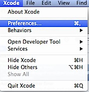

After downloading Xcode 6 beta 6, If you are receiving **Apple Mach-O Linker error, Undefined symbols for architecture** then try clearing the DerivedData for Xcode.

Undefined symbols for architecture x86\_64:

"\_\_TFSs26\_forceBridgeFromObjectiveCU\_\_FTPSs9AnyObject\_MQ\_\_Q\_", referenced from:

  

**Derived data folder location**  

  

You find out the location of derived data using Xcode Preferences. Click Xcode -> Preferences.

  

  

Click Locations tab and navigate to Derived Data section. Then click the arrow next to folder the path.

  

  

Now delete DerivedData folder under Xcode.

  

  

  

Useful link - [http://stackoverflow.com/questions/25371556/swift-beta-6-confusing-linker-error-message](http://stackoverflow.com/questions/25371556/swift-beta-6-confusing-linker-error-message)
