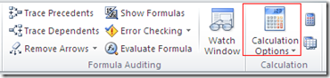

We have already seen how to [How to make a presentation read only in Power Point](http://blogmines.com/blog/2010/02/26/how-to-make-a-powerpoint-in-office-2010-read-only/). Similarly an **excel workbook can be made read only** using Excel Options. Listed below are the steps to **make a workbook read only in Excel 2013 and Excel 2010**

Click on the File menu –> Info menu

Click on the **Protect Workbook** drop down arrow. This would display the following menu list

Click on the **Mark as Final** menu, the following dialog box would appear.

On selecting OK button the following confirmation box will be displayed.

By this way you can **make an workbook in excel 2010 read only and prevent users from making any changes** to the file.

**Also See**: [Different ways to protect workbook in Excel 2013](http://blogmines.com/blog/different-ways-to-protect-workbook-using-excel-2013/)
