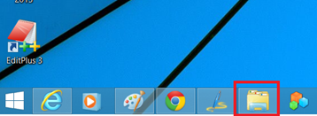
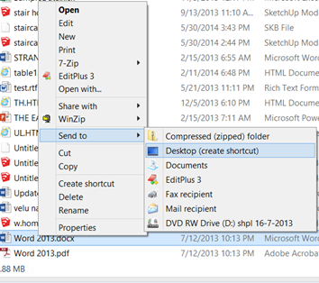
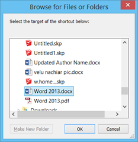
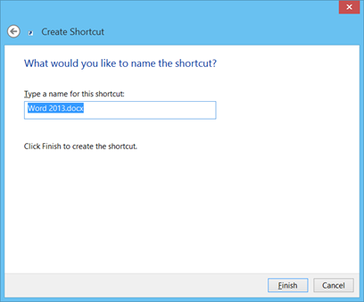

This is in response to the [query](http://blogmines.com/blog/how-to-create-desktop-shortcut-for-office-2010-applications/#comment-269756) posted by user, regarding the steps for creating shortcut to a word file.

> **Sandy July 29, 2014, 7:00 pm**
> 
> I wanted to create a desktop shortcut to a file in Word 2010, but cannot find any instruction to do that. Is it possible?

Let us see how this can be done in Windows 8 installed with Word 2013.

**Method 1**

**Step 1**: Navigate to Windows 8 Desktop.

**Step 2**: Launch Windows explorer from the Taskbar and navigate to the location of the word file.

Step 3: Right click on the file, select Desktop (create shortcut) under Send to option.

This should **create a shortcut for the word document** on your desktop.

**Method 2**

**Step 1**: Navigate to desktop, right click, select Shortcut under New menu.

**Step 2**: Click the Browse button in Create Shortcut window and locate the word document.

**Step 3**: Then click Next and provide a name for your shortcut.

**Step 4**: Then click Finish to create the shortcut on the desktop.
