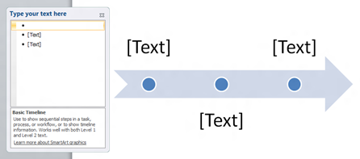

This tutorial is about the steps required to [block emails](http://blogmines.com/blog/2011/10/11/block-emails-based-on-subject-in-outlook-2010/) from specific countries in Outlook 2013. The Junk email filter provides users with the option to add countries to the blocked email list. And any emails with email addresses originating from these countries will be blocked. For example, to block all emails originating from Russia (.ru) use following steps.

**Step 1**: Click Junk option under Outlook Home menu. Then select Junk E-mail Options from the drop down list.

**Step 2**: In the Junk Email Options window, navigate to the last tab International.

**Step 3**: Click the button with caption as “Blocked Top-Level Domain List”

**Step 4**: In the Blocked Top-Level Domain List, scroll down and select the country of interest i.e RU (Russia). Then click OK button to confirm and close the window.

Now all email messages from email address ending with .ru will be blocked in Outlook 2013.

**Also See**: [Where is Junk Email Settings in Outlook](http://blogmines.com/blog/2011/01/17/where-is-the-junk-email-settings-in-outlook-2010/)
