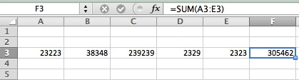
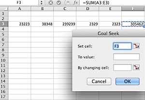

Microsoft Excel has a **Goal Seek** feature which can be used to **derive value** of a cell based on the result set for the cell containing a formula. Let us see this with an example that does a simple addition. In the below screenshot, you should notice that the sum of A3 to E3 is calculated in F3.

Now let us say that you want the final result in F3 as “350000” and this should be achieved by changing the value of C3. For this scenario we can use Goal Seek feature to find out the value to be entered in C3.

In Excel 2011 for Mac, Goal Seek can be accessed from Tools menu.

Enter the Set cell to the cell containing formula i.e F3

Then enter the final result that you need to arrive in “**To value**” field i.e 350000

Click Ok button after entering the cell that needs to be changed to get final result. The following **Goal Seek Status screen** will be displayed with “found a solution” message.

Though we have taken a simple problem do explain Goal Seek feature. This feature will be quite handy when you are working with complex formulas and want to try out different values.
