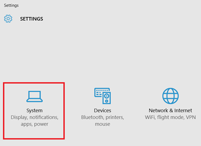

In this short beginners PowerPoint 2013 and PowerPoint 2010 tutorial, we will see the steps to disable advance slide on mouse click. During a **slide show**, you can **move** to **next slide** either by pressing ENTER or SPACEBAR on keyboard or on mouse click. And using **Transitions menu**, you can **disable** or **enable** the advance slide on mouse click.

Click the Transitions menu and navigate to Timing section

If you want to disable the feature, then un mark the check box labelled as **On Mouse Click**.

**Also See**: [Start PowerPoint Slide Show using Windows Explorer](http://blogmines.com/blog/start-powerpoint-slide-show-using-windows-explorer/)
