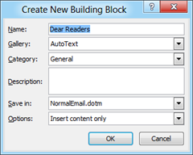

The **Bibliography style** in **Word 2013** and **Word 2010** can be changed using the **References menu**. Listed below are the steps to modify bibliography in Word 2013 and Word 2010. Click references menu, navigate to **Citations & Bibliography** section.

In the **Style** dropdown, this would display the following list of APA Fifth Edition, Chicago Fifteenth Edition, GB7714 2005, GOST – Name Sort, GOST Title Sort, ISO 690 – First Element and Date, ISO 690 – Numerical Reference, MLA Sixth Edition, SIST02 and Turabian Sixth Edition.

The Popular choice for the style are APA, Chicago and MLA. Using the Style dropdown specify the required **Word Bibliography style**.

**Also See**: [Show or hide style pane in Word 2013](http://blogmines.com/blog/show-or-hide-style-pane-in-word-2013/)
