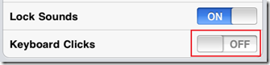

The **sound** heard for **keyboard** **clicks** in iPad can be **disabled** using the settings. To disable the sound

- Tap the settings icon on the iPad home screen.
- In the settings screen, navigate Sound settings.

- In the Sounds settings, Tap the greyed area on Keyboard clicks.

And this would **Turn off the sounds** for the Keyboard clicks in iPad 2

<iframe width="420" height="315" src="//www.youtube.com/embed/Fw_SvmVyJWw" frameborder="0" allowfullscreen></iframe>
