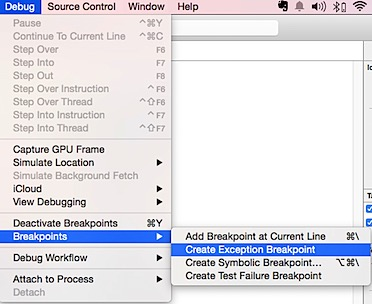
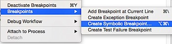
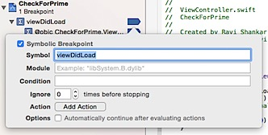
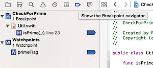
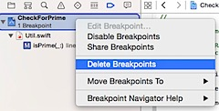
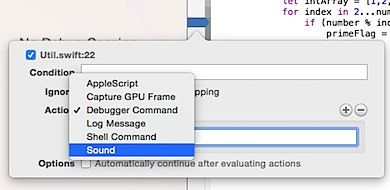

Any beginner iOS developer should be aware of the NSLog statement. This is quite frequently used to debug Objective-C programs. In Swift you can use **println** or **print** statement instead of NSLog to write the debug information to the console log.

\[code language="swift"\]var primeFlag:Bool = true println("input number is \\(number)") if ((number == 2) || (number == 3)) { return primeFlag } \[/code\]

This will write the following message in the console log.

`input number is 5`

But debugging a large app using println statement will be a time consuming process, instead you can use Xcode built-in features for debugging.  

###   
**Breakpoint**

Xcode users can place breakpoint at a specific statement and when the program execution reaches that line it pauses the execution. The breakpoint allows users to examine the value of variables at that specific context.

Like any other IDE, Xcode provides option to **Step Into**, **Step Out**, **Step Over** and **Continue** option.

### Exception Breakpoint

When your app crashes and you want the app the stop at the line of statement that causes the crash then you can use Exception breakpoint. Click Debug menu and select **Create Exception Breakpoint** from the menu list.

### Conditional breakpoint

If you want to pause the execution using a breakpoint when a condition is met then you can use conditional breakpoint.

Right click a breakpoint and select Edit BreakPoint from the list. Then add the add the condition for the breakpoint. In the below screenshot, when index reaches 251 the breakpoint will be activated.

### Symbolic breakpoint

Symbolic breakpoint pauses the program execution when it reaches the specified method. For example you want to pause the program execution in all the viewDidLoad methods then you can specify that using Symbolic breakpoint.

Debug menu -> Breakpoints -> Create Symbolic Breakpoint

Enter the method name in symbol field and to target only specific module instead of all viewDidLoad methods you can enter the module name as well.

### Watch Point

When you want to pause the app execution whenever the value of a variable changes then you can use watch point. You can add a watch point by selecting variable and picking Watch option from the context menu.

### Breakpoint navigator

Xcode Breakpoint navigator will show the list of breakpoints that are currently active in your project.

And you can remove all and selected breakpoints by right clicking on the **Breakpoint navigator** and selecting Delete Breakpoints option.

### Enable sound

Another useful feature which is available as part of Xcode debugging tool is to play sound when a breakpoint condition is met. This is quite useful when you have Xcode debugging in the background and want to let you know when the condition is met by playing the sound.

To specify the condition, click on the Action drop down and select Sound from the list. Then add the notification sound that needs to played when the condition is met.

