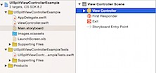
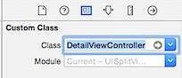
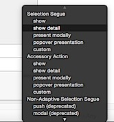
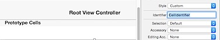
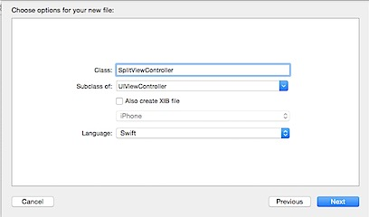
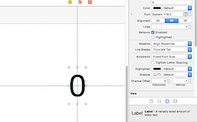
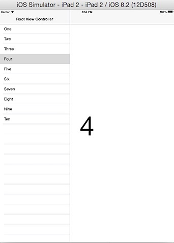

This is a beginners tutorial on SplitViewController using Interface builder with programming language as Swift. There are also some good articles available on SplitViewController, check them out as well - [nhipster](http://nshipster.com/uisplitviewcontroller/) and [whoisryannystrom](http://whoisryannystrom.com/2014/11/17/UISplitViewController-iOS-7/).

Create a new Single View Application.

Choose Language option as Swift and provide a product name.

Navigate to Main.Storyboard and select default View Controller and delete it.

Add a Split View Controller from the object library to the interface builder.

Using Attributes Inspector make Split View Controller as the Initial View Controller

  
Select View Controller in the Interface builder then click Editor menu and select Navigation Controller under Embed In menu option.

Rename ViewController.swift to DetailViewController.swift and change the class name as well.

Navigate to Interface builder and set the class name for ViewController scene to DetailViewController

Now Control + drag and drop TablevIew Prototype cell to NavigationController (DetailViewController) and select segue as show detail. Also set the identifier for the Storyboard Segue as “**ShowDetailIdentifier**"

  

  

Navigate to RootViewController (TableViewController) Provide the Identifier as CellIdentifier for the Prototype Cells.

Right click on the Project Navigator, select New File and Choose the template as Cocoa Touch Class

In the next screen, select subclass as UIViewController and provide a name as SplitViewController

After creating the file, edit SplitViewController subclass to UISplitViewController. Then add the following line to the viewDidLoad method.

  splitViewController?.preferredDisplayMode \= .PrimaryOverlay

The above line is to keep the PrimaryViewController (TableViewController) on top of SecondaryViewController (DetailViewController). You can change this behaviour by setting other types, check the [documentation](https://developer.apple.com/library/ios/documentation/UIKit/Reference/UISplitViewController_class/) for more details.

Now add the PrimaryViewController (TableViewController) by right clicking and selecting New File. Select Cocoa Touch class and in the subclass field pick UITableViewController. Provide the the name for the TableViewController ListTableViewController.

Set the class name for the RootViewController (TableViewController) to the newly created class, ListTableViewController.

Navigate to DetailViewController in the Interface builder, add a label and make it horizontally and vertically centred.

Then add a new IBOutlet in DetailViewController and connect the Outlet to the label in interface builder.

  @IBOutlet var numberLabel:UILabel?

  

Also add property of type Int and the value for this property will be set during the segue transition.  

  

var selectedIndex:Int = 1

  

Make changes to the viewDidLoad method, to set the value for the label and to add back button to the navigation bar.  

  

override func viewDidLoad() {

super.viewDidLoad()

numberLabel?.text \= "\\(selectedIndex)"

// add back button to the navigation bar.

if splitViewController?.respondsToSelector("displayModeButtonItem") == true {

navigationItem.leftBarButtonItem \= splitViewController?.displayModeButtonItem()

navigationItem.leftItemsSupplementBackButton \= true

}

}

  

In the ListTableViewController, add the following code that sets the datasource.  

  

  let names = \["One","Two","Three","Four","Five","Six","Seven","Eight","Nine","Ten”\] (class level declaration)

  

  // MARK: - Table view data source

  

override func numberOfSectionsInTableView(tableView: UITableView) -> Int {

return 1

}

  

override func tableView(tableView: UITableView, numberOfRowsInSection section: Int) -> Int {

return names.count

}

  

override func tableView(tableView: UITableView, cellForRowAtIndexPath indexPath: NSIndexPath) -> UITableViewCell {

let cell = tableView.dequeueReusableCellWithIdentifier("CellIdentifier", forIndexPath: indexPath) as UITableViewCell

  

   cell.textLabel?.text = names\[indexPath.row\]

  

return cell

}

  

Then make changes to the prepareForSegue method to navigate to DetailViewController after setting the selectedIndex property  
  

  override func prepareForSegue(segue: UIStoryboardSegue, sender: AnyObject?) {

if (segue.identifier == "ShowDetailIdentifier") {

var detail: DetailViewController

if let navigationController = segue.destinationViewController as? UINavigationController {

detail = navigationController.topViewController as DetailViewController

} else {

detail = segue.destinationViewController as DetailViewController

}

if let path = tableView.indexPathForSelectedRow() {

detail.selectedIndex = path.row + 1

}

}

}

Download the source from [here](https://github.com/rshankras/UISplitViewControllerExample).
