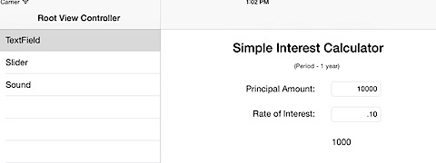

This is a beginners tutorial on UITextFieldDelegate in Swift. We are going to see how to use UITextFieldDelegate by writing a Simple Interest Calculator.

  

Download the source code from [here](https://github.com/rshankras/SwiftDemo)

This calculator uses UILabels and TextFields for displaying and accepting amount and interest. We are going to use the UITextFieldDelegate method to navigate from "Principal Amount" to "Rate of Interest". And when the user taps done on "Rate of Interest” UITextField, the interest is calculated and displayed on the corresponding label.

**Source Code**

import UIKit

  

class TextFieldDemoController: UIViewController, UITextFieldDelegate {

  

@IBOutlet weak var amountTextField: UITextField!

@IBOutlet weak var rateTextField: UITextField!

@IBOutlet weak var interestLabel: UILabel!

var textFields:\[UITextField\] = \[\]

override func viewDidLoad() {

super.viewDidLoad()

self.amountTextField.delegate \= self

self.rateTextField.delegate = self

textFields \= \[amountTextField, rateTextField\]

}

  

override func didReceiveMemoryWarning() {

super.didReceiveMemoryWarning()

// Dispose of any resources that can be recreated.

}

//MARK :- TextField Delegate

func textFieldShouldReturn(textField: UITextField) -> Bool {

var currentTextField = textFields\[0\]

if (currentTextField \== textField) {

currentTextField = textFields\[1\]

currentTextField.becomeFirstResponder()

} else {

currentTextField.resignFirstResponder()

interestLabel.text = "\\(calculateInterest())"

}

return true

}

//MARK :- Calculation

func calculateInterest() -> Double {

let amount: Double \= (amountTextField.text as NSString).doubleValue

let rate:Double \= (rateTextField.text as NSString).doubleValue

return amount \* rate

}

}

  
**Step 1**: Make sure your view controller class conforms to UITextFieldDelegate  
  
**Step 2**: In ViewDidLoad method, set the delegate for the textfields to self (ViewController)  
**Step 3**: Implement textFieldShouldReturn(textField: UITextField) -> Bool(UITextFieldDelegate method) and the code that makes the UITextField FirstResponder and calculates the Interest once the values are entered.  
Download the source code from [here](https://github.com/rshankras/SwiftDemo)
