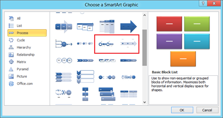
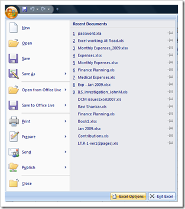

Outlook 2013 and Outlook 2010 has a feature using which the users can **search for mails older than specified days**. This is an useful feature if you want to look only in emails that are older than certain time period. This feature available as part of the Mailbox Cleanup options.

To find mails older than N number of days, click File menu and then navigate to Info menu

Click the drop down arrow available below **Cleanup Tools** option. And then select Mailbox Cleanup from the list of available menus.

In the **Mailbox Cleanup** window, navigate to find section and select the radio option **Find items older than** and specify the **number of days**.

Clicking the **Find** button would display the list of mails which are older than N number of days.
