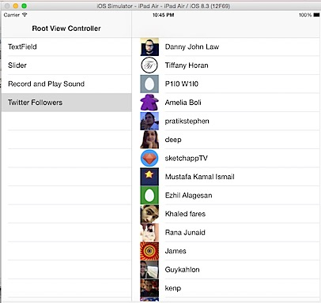

This article provides details about the the steps required to retrieve the followers in from your twitter account. You will learn the following by going through this article

1. Use oAuth to retrieve bearer token.

3. Retrieve twitter followers using API call.

5. Last 20 followers name and profile image will be displayed in a tableview.

Download the source code from [here](https://github.com/rshankras/SwiftDemo).



### Consumer Key and Consumer Secret

First step is to register your app in [apps.twitter.com](https://apps.twitter.com) and get the Consumer Key and Consumer Secret from Application Settings.

### Service Wrapper

Now create a service wrapper which retrieves the bearer token and uses the retrieved token for the service call. In this example the service call will be made to retrieve followers of your Twitter account.  

```swift
public class TwitterServiceWrapper:NSObject { 
    let consumerKey = “” 
    let consumerSecret = “” 
    let authURL = “https://api.twitter.com/oauth2/token” 
}
```

Create a TwitterServiceWrapper class with constants for storing the consumer key, consumer secret and oAuth URL. Replace the consumer\_key and consumer\_secret from your apps.twitter.com account. Next add the following function to retrieve the bearer token using base64 encoded string. We have used Application - only authentication for this example, for more info refer to this [documentation](https://dev.twitter.com/oauth/application-only).  

```swift
// MARK:- Bearer Token

func getBearerToken(completion:(bearerToken: String) ->Void) { 
    var request = NSMutableURLRequest(URL: NSURL(string: authURL)!) 
    request.HTTPMethod = “POST” 
    request.addValue(“Basic “ + getBase64EncodeString(), forHTTPHeaderField: “Authorization”) 
    request.addValue(“application/x-www-form-urlencoded;charset=UTF-8”, forHTTPHeaderField: “Content-Type”) 
    var grantType = “grant\_type=client\_credentials” 
    request.HTTPBody = grantType.dataUsingEncoding(NSUTF8StringEncoding, allowLossyConversion: true)

    NSURLSession.sharedSession() 
        .dataTaskWithRequest(request, completionHandler: { (data: NSData!, response:NSURLResponse!, error: NSError!) -> Void in

            var errorPointer : NSErrorPointer = nil

            if let results: NSDictionary = NSJSONSerialization 
                .JSONObjectWithData(data, options: NSJSONReadingOptions.AllowFragments , error: errorPointer) as? NSDictionary {

                if let token = results[“access\_token”] as? String { 
                    completion(bearerToken: token) 
                } else { 
                    println(results[“errors”]) 
                }

            }
        }).resume() 
}

// MARK:- base64Encode String

func getBase64EncodeString() -> String {

    let consumerKeyRFC1738 = consumerKey.stringByAddingPercentEscapesUsingEncoding(NSASCIIStringEncoding)

    let consumerSecretRFC1738 = consumerSecret.stringByAddingPercentEscapesUsingEncoding(NSASCIIStringEncoding) 
    let concatenateKeyAndSecret = consumerKeyRFC1738! + ”:” + consumerSecretRFC1738!

    let secretAndKeyData = concatenateKeyAndSecret.dataUsingEncoding(NSASCIIStringEncoding, allowLossyConversion: true)

    let base64EncodeKeyAndSecret = secretAndKeyData?.base64EncodedStringWithOptions(NSDataBase64EncodingOptions.allZeros)

    return base64EncodeKeyAndSecret! 
}
```

Now add the following functions which would use the bearer token to make the service call then process the results and store them in TwitterFollower struct.  

```swift
// MARK:- Service Call

func getResponseForRequest(url:String) { 
    var results:NSDictionary 
    getBearerToken({ (bearerToken) -> Void in 
        var request = NSMutableURLRequest(URL: NSURL(string: url)!) 
        request.HTTPMethod = “GET” 
        let token = “Bearer “ + bearerToken 
        request.addValue(token, forHTTPHeaderField: “Authorization”)

        NSURLSession.sharedSession() 
            .dataTaskWithRequest(request, completionHandler: { (data: NSData!, response:NSURLResponse!, error: NSError!) -> Void in

                self.processResult(data, response: response, error: error) 
            }).resume() 
    }) 
}

// MARK:- Process results 
func processResult(data: NSData, response:NSURLResponse, error: NSError?) { 
    var errorPointer : NSErrorPointer = nil 
    if let results: NSDictionary = NSJSONSerialization 
        .JSONObjectWithData(data, options: NSJSONReadingOptions.AllowFragments , error: errorPointer) as? NSDictionary { 
        if var users = results["users"] as? NSMutableArray { 
            for user in users { 
                let follower = TwitterFollower(name: user["name"] as! String, url: user["profile\_image\_url"] as! String) 
                self.delegate?.finishedDownloading(follower) 
            }

        } else { 
            println(results["errors"]) 
        } 
    } 
}
```

### TwitterFollowerDelegate

We also need to create a protocol in TwitterServiceWrapper class. This will inform the delegates once the data is downloaded from the service

```swift
protocol TwitterFollowerDelegate{
    func finishedDownloading(follower:TwitterFollower) 
}
```

  

### TwitterFollower - Place holder struct

TwitterFollower struct will just act as a place holder for storing followers’s name, profile URL and description. TwitterFollower struct looks as shown below.

```swift
struct TwitterFollower { 
    var name: String? 
    var description: String? 
    var profileURL: NSData?

    init (name: String, url: String) { 
        self.name = name 
        let pictureURL = NSURL(string: url) 
        profileURL = NSData(contentsOfURL: pictureURL!) 
    } 
}
```

### Add TableViewController

Now finally we use the followers data retrieved from the service and displayed in a tableview. TwitterFollowerController is a UITableViewController which conforms to TwitterFollowerDelegate protocol. We create an instance of TwitterServiceWrapper class and pass the request URL for retrieving the followers details in viewDidLoad method.  

```swift
class TwitterFollowerController: UITableViewController, TwitterFollowerDelegate { 
    var serviceWrapper: TwitterServiceWrapper = TwitterServiceWrapper() 
    var followers = [TwitterFollower]()

    @IBOutlet weak var activityIndicator: UIActivityIndicatorView!

    override func viewDidLoad() { 
        super.viewDidLoad() 
        serviceWrapper.delegate = self 
        activityIndicator.startAnimating() 
        serviceWrapper.getResponseForRequest(“https://api.twitter.com/1.1/followers/list.json? screen\_name=rshankra&amp;skip\_status=true&amp;include\_user\_entities=false”) 
    }
```

Implement the Table View Data source methods as shown below  

```swift
// MARK: - Table view data source

override func numberOfSectionsInTableView(tableView: UITableView) -> Int { 
    return 1 
} 
override func tableView(tableView: UITableView, numberOfRowsInSection section: Int) -> Int { 
    let numberOfRows = followers.count 
    return numberOfRows 
}

override func tableView(tableView: UITableView, cellForRowAtIndexPath indexPath: NSIndexPath) -> UITableViewCell {

    let cell = tableView.dequeueReusableCellWithIdentifier(“reuseIdentifier”, forIndexPath: indexPath) as! UITableViewCell

    let follower = followers[indexPath.row] as TwitterFollower 
    cell.imageView?.image = UIImage(data: follower.profileURL!) 
    cell.textLabel?.text = follower.name

    return cell 
}
```

The data for followers array will be populated in the TwitterFollowerDelegate method.

```swift
// MARK: - TwitterFollowerDelegate methods

func finishedDownloading(follower: TwitterFollower) { 
    dispatch_async(dispatch_get_main_queue(), { () -> Void in 
        self.followers.append(follower) 
        self.tableView.reloadData() 
        self.activityIndicator.stopAnimating() 
        self.activityIndicator.hidden = true 
    }) 
}
```

We need to make sure that the reloading of data is done in the main thread by calling

```swift
dispatch_async(dispatch_get_main_queue()
```

Download the source code from [here](https://github.com/rshankras/SwiftDemo).
