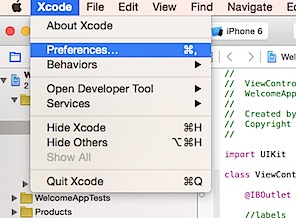

Listed below are the steps to display line number in Xcode editor window. This is quite useful when you are working in a ground and want to communicate the line number of statement to other members.

Click Xcode menu option and select Preferences from the menu list

In the Preferences window, click Text Editing tab.

Then mark the check box with caption as Show Line numbers. Now you should be able to see the line numbers in Xcode editor window.

  

