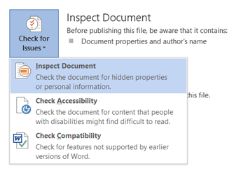
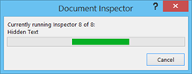

The **standard page colour** of a word document is white. But in Word 2013 and Word 2010, you can also **change the page colour** using the Page Layout menu option. You can do the following to change the word document page colour in Word 2010.

From the File menu, click Page Layout menu option

Navigate to Page Background section.

To change the page colour, click the drop down arrow below the Page Colour option select your desired colour.

If you want to see more colours, then click the More Colours option to launch the Colour Palette.

If you want fill with effects then click **Fill Effects** menu to bring the Fill Effect dialog box.

