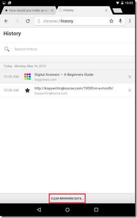
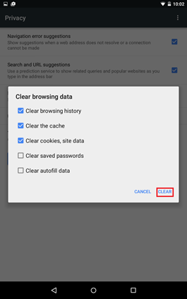

Listed below are the steps clear the browsing history of Google Chrome in a Android Device such as Nexus or Samsung tab.

**Solution 1**: History screen

**Step 1**: Click the Menu option in Google Chrome (right hand side)

**Step 2**: Select History from the drop down list.

**Step 3**: In the History screen, click the Clear Browsing Data option available at bottom of the screen.

**Step 4**: Select the required option under Clear browsing data and click Clear button. Apart from browsing history, you can clear Cache, Cookies and Site data, Saved passwords and autofill data

**Solution 2** : Advanced Option

**Step 1**: Click the menu option and select Settings from the list.

**Step 2**: Click Privacy option under Advanced section.

**Step 3**: In the Privacy screen, click the Clear Browsing Data button to launch screen. Then the Clear button to delete all the browsing history.

