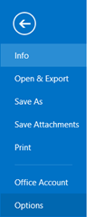

This is in reply to the email received from a reader

> I'm setting up my new Nexus 7 and put the language in as Espanol in error, instead of English, my choice. I cant get it changed and need help.  
> Thank you"

**Step 1**: Tap the menu option in home screen.

**Step 2**: From the list of option, select Ajustes.

**Step 3**: In Ajustes screen, navigate to Personal section and select Idioma e introduction de

**Step 4**: Tap Idioma and select English from the list.

For this demo, I have selected English (India)

**Step 5**: Confirm and save the changes by selecting **Aceptar** in the confirmation pop up screen.

By this way you can change the [display language in Nexus 7](http://blogmines.com/blog/how-to-change-the-display-language-on-google-nexus-7/) (or any Android devices) from Español to English.
