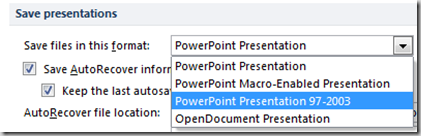

This tutorial explains how to **change** the **default file format** in **PowerPoint 2013 and PowerPoint 2010** while saving a Presentation file. This is useful when most of your organization users are still using Office 2003. As the Office 2003 users will have compatibility issues when they open a presentation file created using PowerPoint 2010. To fix the issue you can change the default file format for saving a file to be compatible with Office 2003.

Click the file menu and then the options link. In the PowerPoint options window, navigate to Save options.

In the Save Options screen, navigate to **Save presentation** section and using the **Save files in this format** drop down you can set the PowerPoint presentation file to be compatible with Office 2003.

After setting the value to **PowerPoint Presentation 97-2003**, click Ok to confirm and save the changes.

BuzzNet Tags: [PowerPoint 2010](http://www.buzznet.com/tags/PowerPoint+2010),[default file format](http://www.buzznet.com/tags/default+file+format),[change file format](http://www.buzznet.com/tags/change+file+format),[Save Presentations](http://www.buzznet.com/tags/Save+Presentations)
