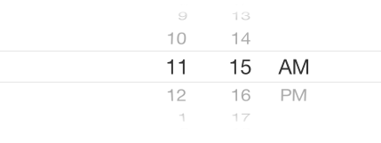

In this short tutorial, we are going to see the steps required use DatePicker in a iOS / Swift project. This demo is done by adding the DatePicker controls to Interface Builder and not programmatically.  

### Date Picker Mode

Date Picker control allow developers to specify the mode such as Date, Time, Date and Time and Count Down Timer. Listed below are the screenshots of each Date Picker mode.  

#### Date Picker (Mode - Time)

[](https://rshankar.com/wp-content/uploads/2015/06/Date-Picker-Mode-set-to-time_full.png)

#### Date Picker (Mode - Date)

[](https://rshankar.com/wp-content/uploads/2015/06/Date-Picker-Mode-set-to-Date_full.png)

#### Date Picker (Mode - Date and Time)

[](https://rshankar.com/wp-content/uploads/2015/06/Date-and-Time-mode-set-for-Date-Picker_full.png)

Using the Date and Time mode does not provide option to pick year. Hence in this demo we are going to use two date picker controls, one for date and another for time.  

### Add ViewContoller and Controls

Add a View Controller (or use existing ViewController) to storyboard then drag and drop 2 date picker controls to the View Controller. Also add a UILabel for displaying the selected date and time values. For the first Date Picker set the mode to Date and for the second as Time.  

[](https://rshankar.com/wp-content/uploads/2015/06/1434546891_full.png)

### Add DatePickerController class

Now add a new file to the project and choose the template as Cocoa Touch class. Provde the name for your class file as DatePickerController. Add the following lines of code that adds IBOutlets to the ViewController

```swift
@IBOutlet var datePicker:UIDatePicker!
@IBOutlet var timePicker:UIDatePicker!
@IBOutlet var dateTimeDisplay:UILabel!
```

Select the ViewController in the Storyboard and set the class in the Identity Inspector to DatePickerController. Now click Show Assistant Editor then Control + drag and drop date picker to class file. Select connect as Action and provide the name for the function as datePickerChanged.  

[](https://rshankar.com/wp-content/uploads/2015/06/1434546565_full.png)

Now you should see the following function added to your class file.  

```swift
@IBAction func datePickerChanged(sender: AnyObject) {
}
```

Repeat this exercise for the TimePicker (second date picker control) with function name as timePickerChanged.  

```swift
@IBAction func timePickerChanged(sender: AnyObject) {
}
```

Also make sure to connect all the IBOutlets from the class file to the corresponding controls in View Controller.

### Set Date and Time

Add the following piece of Date Formatter code just below the IBOutlets definition. We are using two instance of NSDateFormatter to specify the date and time style for each date picker controls.

```swift
let dateFormatter = NSDateFormatter()
let timeFormatter = NSDateFormatter()
```

Add the following function that formats the date and time and assigns the value to UILabel.  

```swift
//MARK:- Date and time
func setDateAndTime() {
    dateFormatter.dateStyle = NSDateFormatterStyle.ShortStyle
    timeFormatter.timeStyle = NSDateFormatterStyle.ShortStyle
    dateTimeDisplay.text = dateFormatter.stringFromDate(datePicker.date) + " " + timeFormatter.stringFromDate(timePicker.date)
}
```

Add the function call to the date picker’s Value Changed methods.  

```swift
@IBAction func datePickerChanged(sender: AnyObject) {
    setDateAndTime()
}

@IBAction func timePickerChanged(sender: AnyObject) {
    setDateAndTime()
}
```

[](https://rshankar.com/wp-content/uploads/2015/06/1434547713_full.png)

Download the source code from [here](https://github.com/rshankras/SwiftDemo) (SwiftDemo -> DatePicker)
